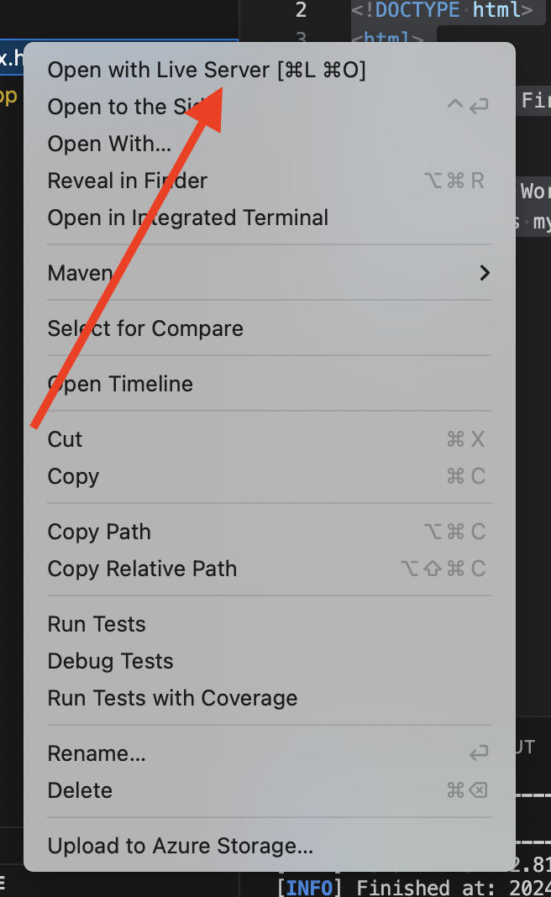
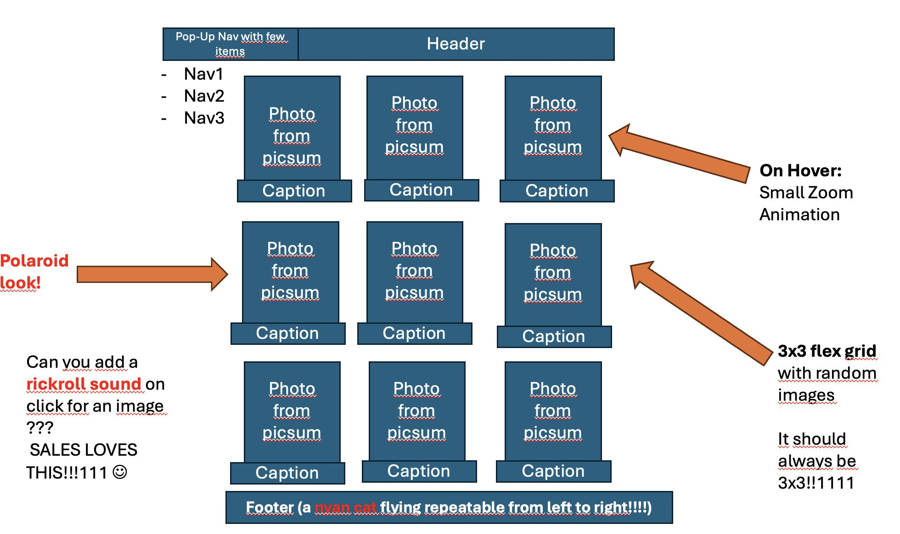

# HTML Image Gallery Lab 🖼️

In this hands-on lab, you'll build an interactive image gallery with animations using HTML, CSS, and JavaScript with the help of GitHub Copilot! This lab demonstrates how GitHub Copilot can assist with front-end development tasks.

## Lab Overview 📋

**Duration**: 45 minutes  
**Difficulty**: Beginner-Intermediate  
**Prerequisites**: Basic knowledge of HTML, CSS, and JavaScript  

## What You'll Build 🏗️

A beautiful polaroid-style image gallery with the following features:

- Grid layout for displaying images
- Hover effects with opacity changes
- Rotation animations on hover
- Click functionality to remove images

## Reqirements 💻

- IDE, e.g. Visual Studio Code
- [Live Server extension](https://marketplace.visualstudio.com/items?itemName=ritwickdey.LiveServer)

## Getting Started 🚀

### Step 1: Create a Basic HTML Structure

First, let's create a basic HTML structure for our page. Create an empty `index.html` file and open it in your editor and ask GitHub Copilot to help you create a basic HTML structure.

!!! tip "Copilot Tip"
    Try typing a comment like `<!-- very basic structure of a modern html page with head body etc -->` and let Copilot generate the initial HTML structure.

??? abstract "Click here to see the initial HTML"
    ```html
    <!-- very basic structure of a modern html page with head body etc -->
    <!DOCTYPE html>
    <html>
      <head>
        <title>My First HTML Page</title>
      </head>
      <body>
        <h1>Hello World!</h1>
        <p>This is my first HTML page.</p>
      </body>
    </html>
    ```

You can have a look at your html file in the browser by right clicking on the file and selecting `Open with Live Server`:

{ width=200px }

<!-- <figure markdown="span">
  { width=200px }
  <figcaption>You can have a look at your html file in the browser by right clicking on the file and selecting `Open with Live Server`</figcaption>
</figure> -->

### Step 2: Add an Image Gallery

Now, let's add an image gallery to our page. We'll use GitHub Copilot to help us create a grid of images.

!!! tip "Copilot Tip"
    Add a comment describing what you want to create, such as `<!-- image gallery using random images from the picsum page. For further styling already add appropriate classes. All images should have the same width and height -->`

??? abstract "After Copilot generates the code, your HTML should include something like:"
    ```html
    <!-- very basic structure of a modern html page with head body etc -->
    <!DOCTYPE html>
    <html>
      <head>
        <title>My First HTML Page</title>
      </head>
      <body>
        <h1>Hello World!</h1>
        <p>This is my first HTML page.</p>
        <!-- image gallery using random images from the picsum page. For further styling already add appropriate classes. All images should have the same width and height -->
          <div class="gallery">
        
        
        
        
        
        
        
        
        
      </div>
      </body>
    </html>
    ```

Optionally, ask Copilot Chat if it is possible to make the images different from each other. You can use the `?random=` query parameter to get different images.

??? abstract "Sample way to have different images from each other"
    ```html
    <!-- very basic structure of a modern html page with head body etc -->
    <!DOCTYPE html>
    <html>
      <head>
        <title>My First HTML Page</title>
      </head>
      <body>
        <h1>Hello World!</h1>
        <p>This is my first HTML page.</p>
        <!-- image gallery using random images from the picsum page. For further styling already add appropriate classes. All images should have the same width and height -->
          <div class="gallery">
        
        
        
        
        
        
        
        
        
      </div>
      </body>
    </html>
    ```

### Step 3: Style the Gallery with CSS

Let's add some CSS to style our gallery. We'll create a 3 by 3 grid layout and add some basic styling to the images. We want the images to have a polaroid effect.

!!! tip "Copilot Tip"
    Add a style tag in the head section and add a comment describing the styling you want to create. Or you can use Copilot Ask or Edit Mode to generate the styling for the polaroid effect.

You can use the following prompt in Github Copilot chat to generate the CSS code for the polaroid effect: ``I want images in the gallery to have a 3 by 3 grid layout and look like a polaroid photo. What do I need to add?``

???+ "Add this to your head section:"
    ```html
    <style>
      /* 3x3 Gallery grid layout */
      .gallery {
        display: grid;
        grid-template-columns: repeat(3, 1fr);
        grid-gap: 10px;
        justify-content: center;
        align-items: center;
        margin: 0 auto;
        width: 600px;
        position: relative;
      }
      /* Image styles */
      .gallery img {
        width: 200px;
        height: 200px;
        box-shadow: 0 4px 8px 0 rgba(0, 0, 0, 0.2);
        border: 15px solid white;
        border-radius: 5px;
        transition: opacity 0.5s, transform 0.5s;
      }
    </style>
    ```

### Step 4: Add Hover Effects

Now, let's add some hover effects to make our gallery more interactive. The images should wobble when you hover over them in an infinite loop. We also want to reduce the opacity of the non-hovered images.

!!! tip "Copilot Tip"
    Ask Github Copilot Ask/Edit Mode to generate the styling code for hovering effects. Remember to have the index.html file open in the editor.

Inspect the result and accept the changes made under ``<style>`` tag in your html file.

??? abstract "Sample style addition to your existing style tag:"
    ```css
    /* Image hover styles */
    .gallery img:hover {
      box-shadow: 0 8px 16px 0 rgba(0, 0, 0, 0.2);
      animation: rotate 2s infinite;
      opacity: 1 !important;
    }
    /* Gallery hover styles */
    .gallery:hover img {
      opacity: 0.6;
    }
    /* Image rotation animation */
    @keyframes rotate {
      0%, 100% {
        transform: rotate(0deg);
      }
      50% {
        transform: rotate(5deg);
      }
    }
    ```

Play around with the values of the keyframes to see how the wobble effect changes.

Refresh your browser to see the opacity effect on the non-hovered images in the gallery. Hover with your mouse over the different images to see the opacity effect.

### Step 5: Add Click Functionality to Remove Images

In this step, you will add JavaScript to remove an image from the gallery when you click on it.

!!! tip "Copilot Tip"
    Use GitHub Copilot chat to generate the JavaScript code for removing an image from the gallery when you click on it. Remember to have the index.html file open in the editor, or add the file as context.

You can use the following prompt in the chat: ``I would like to remove an element from the image gallery when clicking on it. Can you return the whole html page with the new added javascript?``

After adding the JavaScript, your complete HTML should look something like the sample below.

??? abstract "Sample solution after adding the JavaScript"
    ```html
    <!-- very basic structure of a modern html page with head body etc -->
    <!DOCTYPE html>
    <html>
      <head>
        <title>My First HTML Page</title>
        <style>
          /* Gallery grid layout */
          .gallery {
            display: grid;
            grid-template-columns: repeat(3, 1fr);
            grid-gap: 10px;
            justify-content: center;
            align-items: center;
            margin: 0 auto;
            width: 600px;
            position: relative;
          }
          /* Image styles */
          .gallery img {
            width: 200px;
            height: 200px;
            box-shadow: 0 4px 8px 0 rgba(0, 0, 0, 0.2);
            border: 15px solid white;
            border-radius: 5px;
            transition: opacity 0.5s, transform 0.5s;
          }
          /* Image hover styles */
          .gallery img:hover {
            box-shadow: 0 8px 16px 0 rgba(0, 0, 0, 0.2);
            animation: rotate 2s infinite;
            opacity: 1 !important;
          }
          /* Gallery hover styles */
          .gallery:hover img {
            opacity: 0.6;
          }
          .fade-out {
            opacity: 0;
            transition: opacity 3s ease-out;
          }
          /* Image rotation animation */
          @keyframes rotate {
            0%,
            100% {
              transform: rotate(0deg);
            }
            50% {
              transform: rotate(5deg);
            }
          }
        </style>
      </head>
      <body>
        <!-- image gallery using random images from the picsum page. For further styling already add appropriate classes. All images should have the same width and height -->
        <div class="gallery">
          
          
          
          
          
          
          
          
          
        </div>
        <script>
          // Select all images in the gallery
          var images = document.querySelectorAll(".gallery img");
          // Add an event listener to each image
          images.forEach(function (image) {
            image.addEventListener("click", function (e) {
              // Remove the image when it's clicked
              e.target.remove();
            });
          });
        </script>
      </body>
    </html>
    ```

!!! tip "Copilot Tip"
    Ask Copilot chat why a script tag can be placed in the body tag: "Why is it better in this case to place the script tag at the end of the body tag?"

## Bonus Challenge: Using Agent Mode & Vision Input to create the gallery 🖼️

In this step, we'll leverage GitHub Copilot’s **Agent Mode** and **Vision Input** to transform a mockup image into a fully functional HTML page with embedded CSS.

Add the following mockup image to the Github Copilot as context, by copying it and pasting it in Copilot chat.

??? abstract "Mockup image for the gallery"
    

!!! note "Prompt for Copilot Agent Mode:"  
    Can you create an HTML page for me with the given mockup? Please take a close look at the designer's remarks marked with arrows! Render one HTML page with embedded CSS. Photos should have a white background.

Here are the steps you can follow:

1. Create a new HTML file (e.g., `index-agent.html`).
2. Open GitHub Copilot Chat and switch to **Agent Mode**.  
3. Upload the mockup image via pasting it to the chat or by clicking `Add Context` button.  
4. Paste the prompt above and submit.  
5. Accept the generated HTML & CSS code from Copilot.
6. Preview with Live Server.

What do you think about this result? Is it better than your previous work?

## Additional Bonus Challenges 🌟

If you have extra time, try these bonus challenges with GitHub Copilot:

1. Add a button to reset the gallery (bring back all removed images)
2. Add a fade-out animation before removing the images
3. Add a counter to show how many images are currently displayed
4. Add a filter effect (like grayscale or sepia) on hover

## Summary 📝

In this lab, you've learned how to:

- Use GitHub Copilot to generate HTML, CSS, and JavaScript code
- Create an interactive image gallery with hover effects and animations
- Implement click functionality to remove elements from the DOM
- Use GitHub Copilot chat to get explanations and improve your code

GitHub Copilot has helped you write code faster and with less effort, allowing you to focus on the creative aspects of your project rather than the implementation details. This is just a small example of how AI-assisted coding can enhance your development workflow! 🚀

---
**Contributed by:** Jeffrey Groneberg
