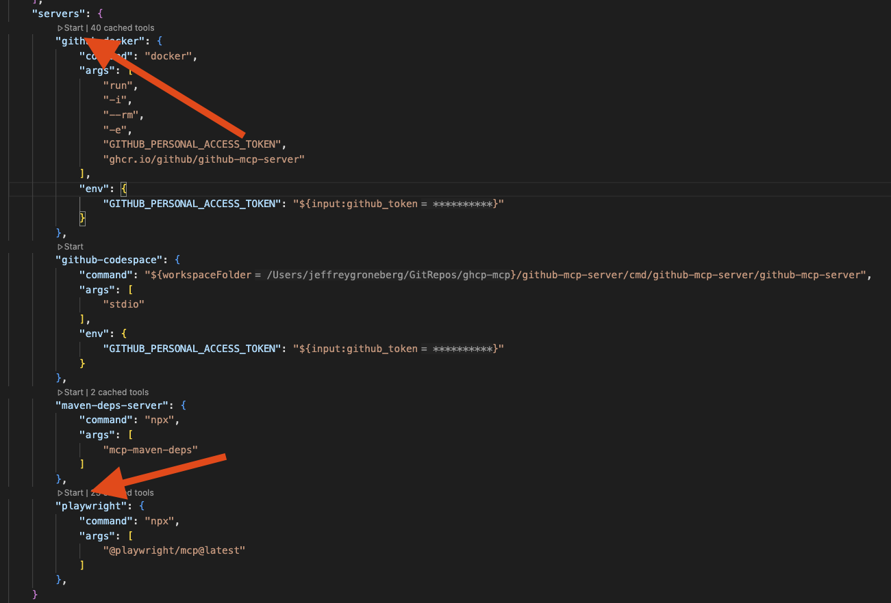
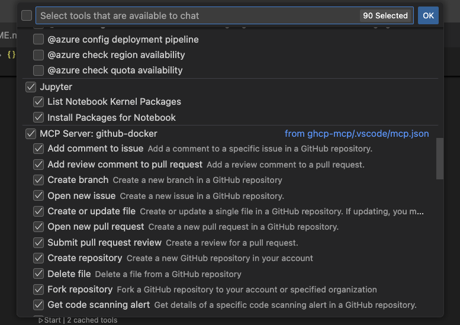

# Four in a Row MCP Game with GitHub Copilot

Welcome to this exciting exercise where you'll experience the power of GitHub Copilot's agent mode integrated with a custom Model Context Protocol (MCP) server! This hands-on lab demonstrates how to play a classic Four in a Row (Connect Four) game directly through GitHub Copilot Chat using a Spring Boot-based MCP server.

The main purpose of this demo is to showcase how MCP servers can extend GitHub Copilot's capabilities beyond code generation to include interactive applications and real-time game logic.

## Lab Overview 📋

**Duration**: 30-45 minutes  
**Difficulty**: Intermediate  

## Good to know

This exercise demonstrates the interactive capabilities of GitHub Copilot when connected to custom MCP servers. Unlike traditional code generation, this lab focuses on real-time interaction and game state management through natural language commands.

!!! info "Dynamic Game Experience!"
    **The game responses and strategies may vary between sessions. GitHub Copilot will adapt its gameplay and responses based on the current game state and your moves!**

    Each game session will be unique, and Copilot may employ different strategies or provide varying levels of difficulty. This showcases the dynamic nature of AI-powered interactions through MCP.

## Prerequisites

You'll need to have the Four in a Row MCP server repository available. You can either:

1. Clone the repository to your local machine:
   ```bash
   git clone https://github.com/jeffreygroneberg/mcp-fiar
   cd mcp-fiar
   ```

2. Or work with the provided project structure if it's already available in your workspace.

Make sure you have:
- Java JDK 17 or later installed
- Maven 3.6 or later
- Visual Studio Code with the GitHub Copilot extension installed and configured

## MCP Server Setup

Before starting the game, you need to build and configure the MCP server.

### Step 1: Build the Project

First, build the Spring Boot application using Maven:

```bash
./mvnw clean install
```

This will create the JAR file at `target/mcp-fiar-0.0.1-SNAPSHOT.jar` that the MCP server will use.

### Step 2: Configure MCP Server

The project includes a VS Code MCP configuration file (`.vscode/mcp.json`) that should look like this:

```json
{
  "servers": {
    "fiar-game-mcp-weather": {
      "command": "java",
      "args": [
        "-Dspring.ai.mcp.server.stdio=true",
        "-Dspring.main.web-application-type=none",
        "-Dlogging.pattern.console=",
        "-jar",
        "${workspaceFolder}/target/mcp-fiar-0.0.1-SNAPSHOT.jar"
      ]
    }
  }
}
```

### Step 3: Start the MCP Server

1. Open the `.vscode/mcp.json` file in VS Code
2. Hover over the server entry and click the **"Start Server"** button that appears
3. The MCP server will start and be ready to communicate with GitHub Copilot

{ width=750px }

### Check MCP Server Status

Switch to GitHub Copilot Chat and verify the MCP tools are available:

1. Click the **tools button** in the input panel
2. You should see the Four in a Row game tools available
3. **Enable all tools** for the MCP server

{ width=500px }

## Step 1: Starting Your First Game

Now let's start playing! Switch to GitHub Copilot Chat and use the following prompt to begin:

- Let's play Four in a Row! Please start a new game with a standard 7x6 grid.

When the agent processes your request, it will:

- Create a new game instance using the MCP server
- Display an empty game board
- Explain the rules and how to make moves
- Wait for your first move

## Step 2: Making Your Moves

To make a move, simply tell GitHub Copilot which column you'd like to drop your piece into:

- I want to drop my piece in column 4

Or you can use simpler commands:

- Column 3
- 4

The game accepts column numbers from 1 to 7 (for a standard board). GitHub Copilot will:

- Process your move
- Update the game board
- Make its counter-move
- Display the updated board state
- Check for win conditions

## Step 3: Game Management Commands

During gameplay, you can use various commands to manage your game experience:

### View Current Board State

- Show me the current board

### Check All Active Games

- Get all games

### Reset All Games

- Reset all games

### Start Multiple Games

- Start a new Four in a Row game with a 5x5 board

## Step 4: Advanced Gameplay

Once you're comfortable with basic moves, try these advanced interactions:

### Strategic Planning

- What's your strategy for this game? Can you explain your last move?

### Custom Board Sizes

- Let's play with a 6x6 grid this time

### Game Analysis

- Can you analyze the current board position and suggest my best move?

## Understanding the Game Logic

The Four in a Row MCP server is built with Spring Boot and implements the following structure:

### Core Components

- **`McpFiarApplication.java`** - Spring Boot application entry point
- **`FiarService.java`** - Game service interface defining game operations
- **`Game.java`** - Game state model containing board state and game metadata
- **`GameStatus.java`** - Enum for game status (IN_PROGRESS, PLAYER_ONE_WON, PLAYER_TWO_WON, DRAW)
- **`FiarServiceImpl.java`** - Implementation of the core game logic

### Game Rules

1. **Objective**: Connect four of your pieces in a row (horizontally, vertically, or diagonally)
2. **Turns**: Players alternate dropping pieces into columns
3. **Gravity**: Pieces fall to the lowest available position in the selected column
4. **Winning**: First player to connect four pieces wins
5. **Draw**: If the board fills without a winner, the game is a draw

### MCP Integration

The game leverages the [Spring AI Model Context Protocol (MCP)](https://docs.spring.io/spring-ai-mcp/reference/spring-mcp.html) to:

- Maintain game state between conversations
- Process natural language commands
- Provide real-time game updates
- Handle multiple concurrent games

## Troubleshooting

### MCP Server Not Starting

If the MCP server doesn't start:

1. Ensure Java JDK 17+ is installed
2. Verify Maven build completed successfully
3. Check that the JAR file exists at `target/mcp-fiar-0.0.1-SNAPSHOT.jar`
4. Restart VS Code and try again

### GitHub Copilot Not Recognizing Commands

If Copilot doesn't respond to game commands:

1. Verify the MCP server is running (check the tools panel)
2. Ensure all MCP tools are enabled
3. Try restarting the MCP server
4. Use more explicit commands like "drop piece in column 3"

### Game State Issues

If the game state seems incorrect:

1. Use the "Show me the board" command to refresh
2. Try "Get all games" to see all active games
3. Use "Reset all games" to start fresh if needed

## Next Steps

After completing this lab, you can:

1. **Explore the Source Code**: Visit the [GitHub repository](https://github.com/jeffreygroneberg/mcp-fiar) to understand the implementation
2. **Extend the Game**: Add new features like different board sizes or AI difficulty levels
3. **Create Your Own MCP Server**: Use this as a template for building custom MCP integrations
4. **Integrate with Other Tools**: Combine the game with other MCP servers for enhanced functionality

## Resources

- [Spring AI MCP Documentation](https://docs.spring.io/spring-ai-mcp/reference/spring-mcp.html) - Official documentation for Spring AI Model Context Protocol
- [GitHub Repository](https://github.com/jeffreygroneberg/mcp-fiar) - Source code for the Four in a Row MCP server
- [GitHub Copilot Documentation](https://docs.github.com/en/copilot) - Information about GitHub Copilot features and capabilities
- [Model Context Protocol Specification](https://modelcontextprotocol.io/) - Official MCP specification

Enjoy your game and experience the power of GitHub Copilot with custom MCP servers! 🎮

---
**Contributed by:** Jeffrey Groneberg