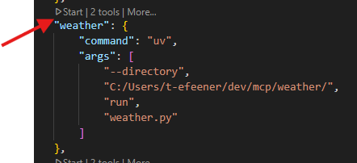
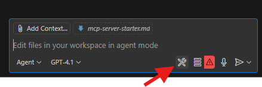
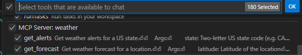
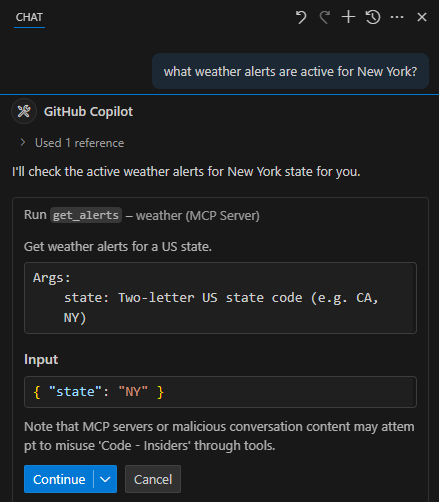

# Build Your Own MCP Server

In this tutorial, we'll build a simple MCP (Model Context Protocol) weather server and connect it to VS Code with GitHub Copilot. We'll start with a basic setup, and then progress to more complex use cases.

## Lab Overview 📋

**Duration**: 60-90 minutes  
**Difficulty**: Intermediate

This lab is mainly based on the Model Context Protocol's [quickstart guide](https://modelcontextprotocol.io/quickstart/server) to create an MCP server, with additional VS Code integration guides, screenshots, and step-by-step instructions for GitHub Copilot integration.

## What we'll be building

Many LLMs do not currently have the ability to fetch live weather forecasts and severe weather alerts. Let's use MCP to solve that!

We'll build a server that exposes two tools: `get-alerts` and `get-forecast`. Then we'll connect the server to VS Code through the MCP configuration:

{ width=400px }

**This guide focuses on VS Code integration.** While servers can connect to any MCP client, we've chosen VS Code here because it's our primary IDE and offers excellent integration with GitHub Copilot.

<!-- !!! warning "Local Execution Only"
    **Because MCP servers run locally, they currently only support desktop environments.** Remote hosts and cloud-based execution are in active development. -->

## Prerequisites

This demonstration assumes you have familiarity with Large Language Models (LLMs).

Before we start, make sure you have:

- VS Code installed with the GitHub Copilot extension enabled
- Basic familiarity with your chosen programming language. and its installation
- Understanding of REST APIs and JSON

## Core MCP Concepts

MCP servers can provide three main types of capabilities:

1. **Resources**: File-like data that can be read by clients (like API responses or file contents)
2. **Tools**: Functions that can be called by the LLM (with user approval)
3. **Prompts**: Pre-written templates that help users accomplish specific tasks

This tutorial will primarily focus on **tools**.

## Implementation

Choose your preferred programming language to build the MCP server:

=== "Python"

    Let's get started with building our weather server! You can find the complete code for what we'll be building [here](https://github.com/modelcontextprotocol/quickstart-resources/tree/main/weather-server-python).

    ### Python System requirements

    * Python 3.10 or higher installed
    * You must use the Python MCP SDK 1.2.0 or higher

    ### Set up your environment    
    
    First, let's install `uv` and set up our Python project and environment:

    === "Windows"
        ```powershell
        # Install uv package manager
        powershell -ExecutionPolicy ByPass -c "irm https://astral.sh/uv/install.ps1 | iex"
        ```

    === "macOS/Linux"
        ```bash
        # Install uv package manager
        curl -LsSf https://astral.sh/uv/install.sh | sh
        ```

    Make sure to restart your terminal afterwards to ensure that the `uv` command gets picked up.

    Now, let's create and set up our project:

    === "Windows"
        ```powershell
        # Create a new directory for our project
        uv init weather-mcp
        cd weather-mcp

        # Create virtual environment and activate it
        uv venv
        .venv\Scripts\activate

        # Install dependencies
        uv add "mcp[cli]" httpx

        # Create our server file
        new-item weather.py
        ```

    === "macOS/Linux"
        ```bash
        # Create a new directory for our project
        uv init weather-mcp
        cd weather-mcp

        # Create virtual environment and activate it
        uv venv
        source .venv/bin/activate

        # Install dependencies
        uv add "mcp[cli]" httpx

        # Create our server file
        touch weather.py
        ```

    ### Building your server

    #### Importing packages and setting up the instance

    Add these to the top of your `weather.py`:

    ```python
    from typing import Any
    import httpx
    from mcp.server.fastmcp import FastMCP

    # Initialize FastMCP server
    mcp = FastMCP("weather")

    # Constants
    NWS_API_BASE = "https://api.weather.gov"
    USER_AGENT = "weather-app/1.0"
    ```

    The FastMCP class uses Python type hints and docstrings to automatically generate tool definitions, making it easy to create and maintain MCP tools.

    #### Helper functions

    Next, let's add our helper functions for querying and formatting the data from the National Weather Service API:

    ```python
    async def make_nws_request(url: str) -> dict[str, Any] | None:
        """Make a request to the NWS API with proper error handling."""
        headers = {
            "User-Agent": USER_AGENT,
            "Accept": "application/geo+json"
        }
        async with httpx.AsyncClient() as client:
            try:
                response = await client.get(url, headers=headers, timeout=30.0)
                response.raise_for_status()
                return response.json()
            except Exception:
                return None

    def format_alert(feature: dict) -> str:
        """Format an alert feature into a readable string."""
        props = feature["properties"]
        return f"""
    Event: {props.get('event', 'Unknown')}
    Area: {props.get('areaDesc', 'Unknown')}
    Severity: {props.get('severity', 'Unknown')}
    Description: {props.get('description', 'No description available')}
    Instructions: {props.get('instruction', 'No specific instructions provided')}
    """
    ```

    #### Implementing tool execution

    The tool execution handler is responsible for actually executing the logic of each tool. Let's add it:

    ```python
    @mcp.tool()
    async def get_alerts(state: str) -> str:
        """Get weather alerts for a US state.

        Args:
            state: Two-letter US state code (e.g. CA, NY)
        """
        url = f"{NWS_API_BASE}/alerts/active/area/{state}"
        data = await make_nws_request(url)

        if not data or "features" not in data:
            return "Unable to fetch alerts or no alerts found."

        if not data["features"]:
            return "No active alerts for this state."

        alerts = [format_alert(feature) for feature in data["features"]]
        return "\n---\n".join(alerts)

    @mcp.tool()
    async def get_forecast(latitude: float, longitude: float) -> str:
        """Get weather forecast for a location.

        Args:
            latitude: Latitude of the location
            longitude: Longitude of the location
        """
        # First get the forecast grid endpoint
        points_url = f"{NWS_API_BASE}/points/{latitude},{longitude}"
        points_data = await make_nws_request(points_url)

        if not points_data:
            return "Unable to fetch forecast data for this location."

        # Get the forecast URL from the points response
        forecast_url = points_data["properties"]["forecast"]
        forecast_data = await make_nws_request(forecast_url)

        if not forecast_data:
            return "Unable to fetch detailed forecast."

        # Format the periods into a readable forecast
        periods = forecast_data["properties"]["periods"]
        forecasts = []
        for period in periods[:5]:  # Only show next 5 periods
            forecast = f"""
    {period['name']}:
    Temperature: {period['temperature']}°{period['temperatureUnit']}
    Wind: {period['windSpeed']} {period['windDirection']}
    Forecast: {period['detailedForecast']}
    """
            forecasts.append(forecast)

        return "\n---\n".join(forecasts)
    ```

    #### Running the server

    Finally, let's initialize and run the server:

    ```python
    if __name__ == "__main__":
        # Initialize and run the server
        mcp.run(transport='stdio')
    ```

    Your server is complete! Run `uv run weather.py` to confirm that everything's working.

=== "TypeScript"

    Let's get started with building our weather server! You can find the complete code for what we'll be building [here](https://github.com/modelcontextprotocol/quickstart-resources/tree/main/weather-server-typescript).

    ### TypeScript System requirements

    For TypeScript, make sure you have the latest version of Node installed.

    ### Set up your environment    
    
    First, let's install Node.js and npm if you haven't already. You can download them from [nodejs.org](https://nodejs.org/).
    Verify your Node.js installation:

    === "Windows"
        ```powershell
        node --version
        npm --version
        ```

    === "macOS/Linux"
        ```bash
        node --version
        npm --version
        ```

    For this tutorial, you'll need Node.js version 16 or higher.

    Now, let's create and set up our project:

    === "Windows"
        ```powershell
        # Create a new directory for our project
        mkdir weather-mcp
        cd weather-mcp

        # Initialize a new npm project
        npm init -y

        # Install dependencies
        npm install @modelcontextprotocol/sdk zod
        npm install -D @types/node typescript

        # Create our files
        mkdir src
        new-item src\index.ts
        ```

    === "macOS/Linux"
        ```bash
        # Create a new directory for our project
        mkdir weather-mcp
        cd weather-mcp

        # Initialize a new npm project
        npm init -y

        # Install dependencies
        npm install @modelcontextprotocol/sdk zod
        npm install -D @types/node typescript

        # Create our files
        mkdir src
        touch src/index.ts
        ```

    Update your `package.json` to add type: "module" and a build script:

    ```json
    {
      "type": "module",
      "bin": {
        "weather": "./build/index.js"
      },
      "scripts": {
        "build": "tsc"
      },
      "files": ["build"]
    }
    ```

    Create a `tsconfig.json` in the root of your project:

    ```json
    {
      "compilerOptions": {
        "target": "ES2022",
        "module": "Node16",
        "moduleResolution": "Node16",
        "outDir": "./build",
        "rootDir": "./src",
        "strict": true,
        "esModuleInterop": true,
        "skipLibCheck": true,
        "forceConsistentCasingInFileNames": true
      },
      "include": ["src/**/*"],
      "exclude": ["node_modules"]
    }
    ```

    ### Building your server

    #### Importing packages and setting up the instance

    Add these to the top of your `src/index.ts`:

    ```typescript
    import { McpServer } from "@modelcontextprotocol/sdk/server/mcp.js";
    import { StdioServerTransport } from "@modelcontextprotocol/sdk/server/stdio.js";
    import { z } from "zod";

    const NWS_API_BASE = "https://api.weather.gov";
    const USER_AGENT = "weather-app/1.0";

    // Create server instance
    const server = new McpServer({
      name: "weather",
      version: "1.0.0",
      capabilities: {
        resources: {},
        tools: {},
      },
    });
    ```

    #### Helper functions

    Next, let's add our helper functions for querying and formatting the data from the National Weather Service API:

    ```typescript
    // Helper function for making NWS API requests
    async function makeNWSRequest<T>(url: string): Promise<T | null> {
      const headers = {
        "User-Agent": USER_AGENT,
        Accept: "application/geo+json",
      };

      try {
        const response = await fetch(url, { headers });
        if (!response.ok) {
          throw new Error(`HTTP error! status: ${response.status}`);
        }
        return (await response.json()) as T;
      } catch (error) {
        console.error("Error making NWS request:", error);
        return null;
      }
    }

    interface AlertFeature {
      properties: {
        event?: string;
        areaDesc?: string;
        severity?: string;
        status?: string;
        headline?: string;
      };
    }

    // Format alert data
    function formatAlert(feature: AlertFeature): string {
      const props = feature.properties;
      return [
        `Event: ${props.event || "Unknown"}`,
        `Area: ${props.areaDesc || "Unknown"}`,
        `Severity: ${props.severity || "Unknown"}`,
        `Status: ${props.status || "Unknown"}`,
        `Headline: ${props.headline || "No headline"}`,
        "---",
      ].join("\n");
    }
    ```

    #### Implementing tool execution

    The tool execution handler is responsible for actually executing the logic of each tool. Let's add it:

    ```typescript
    // Register weather tools
    server.tool(
      "get-alerts",
      "Get weather alerts for a state",
      {
        state: z.string().length(2).describe("Two-letter state code (e.g. CA, NY)"),
      },
      async ({ state }) => {
        const stateCode = state.toUpperCase();
        const alertsUrl = `${NWS_API_BASE}/alerts?area=${stateCode}`;
        const alertsData = await makeNWSRequest<AlertsResponse>(alertsUrl);

        if (!alertsData) {
          return {
            content: [
              {
                type: "text",
                text: "Failed to retrieve alerts data",
              },
            ],
          };
        }

        const features = alertsData.features || [];
        if (features.length === 0) {
          return {
            content: [
              {
                type: "text",
                text: `No active alerts for ${stateCode}`,
              },
            ],
          };
        }

        const formattedAlerts = features.map(formatAlert);
        const alertsText = `Active alerts for ${stateCode}:\n\n${formattedAlerts.join("\n")}`;

        return {
          content: [
            {
              type: "text",
              text: alertsText,
            },
          ],
        };
      },
    );

    server.tool(
      "get-forecast",
      "Get weather forecast for a location",
      {
        latitude: z.number().min(-90).max(90).describe("Latitude of the location"),
        longitude: z
          .number()
          .min(-180)
          .max(180)
          .describe("Longitude of the location"),
      },
      async ({ latitude, longitude }) => {
        // Get grid point data
        const pointsUrl = `${NWS_API_BASE}/points/${latitude.toFixed(4)},${longitude.toFixed(4)}`;
        const pointsData = await makeNWSRequest<PointsResponse>(pointsUrl);

        if (!pointsData) {
          return {
            content: [
              {
                type: "text",
                text: `Failed to retrieve grid point data for coordinates: ${latitude}, ${longitude}. This location may not be supported by the NWS API (only US locations are supported).`,
              },
            ],
          };
        }

        const forecastUrl = pointsData.properties?.forecast;
        if (!forecastUrl) {
          return {
            content: [
              {
                type: "text",
                text: "Failed to get forecast URL from grid point data",
              },
            ],
          };
        }

        // Get forecast data
        const forecastData = await makeNWSRequest<ForecastResponse>(forecastUrl);
        if (!forecastData) {
          return {
            content: [
              {
                type: "text",
                text: "Failed to retrieve forecast data",
              },
            ],
          };
        }

        const periods = forecastData.properties?.periods || [];
        if (periods.length === 0) {
          return {
            content: [
              {
                type: "text",
                text: "No forecast periods available",
              },
            ],
          };
        }

        // Format forecast periods
        const formattedForecast = periods.map((period: ForecastPeriod) =>
          [
            `${period.name || "Unknown"}:`,
            `Temperature: ${period.temperature || "Unknown"}°${period.temperatureUnit || "F"}`,
            `Wind: ${period.windSpeed || "Unknown"} ${period.windDirection || ""}`,
            `${period.shortForecast || "No forecast available"}`,
            "---",
          ].join("\n"),
        );

        const forecastText = `Forecast for ${latitude}, ${longitude}:\n\n${formattedForecast.join("\n")}`;

        return {
          content: [
            {
              type: "text",
              text: forecastText,
            },
          ],
        };
      },
    );
    ```

    #### Running the server

    Finally, implement the main function to run the server:

    ```typescript
    async function main() {
      const transport = new StdioServerTransport();
      await server.connect(transport);
      console.error("Weather MCP Server running on stdio");
    }

    main().catch((error) => {
      console.error("Fatal error in main():", error);
      process.exit(1);
    });
    ```

    Make sure to run `npm run build` to build your server! This is a very important step in getting your server to connect.

=== "Java"

    Let's get started with building our weather server! You can find the complete code for what we'll be building [here](https://github.com/spring-projects/spring-ai-examples/tree/main/model-context-protocol/weather/starter-stdio-server).

    !!! info "Spring AI MCP Integration"
        This guide uses Spring AI MCP auto-configuration and boot starters for simplified development. For manual MCP server creation, consult the Java SDK documentation.

    ### Java System requirements

    * Java 17 or higher installed
    * [Spring Boot 3.3.x](https://docs.spring.io/spring-boot/installing.html) or higher

    ### Set up your environment

    Use the [Spring Initializer](https://start.spring.io/) to bootstrap the project, or create it manually:

    === "Windows"
        ```powershell
        # Create a new directory for our project
        mkdir weather-mcp
        cd weather-mcp

        # Initialize Maven project structure
        mkdir src\main\java\com\example\weather
        mkdir src\main\resources

        # Create pom.xml
        new-item pom.xml
        ```

    === "macOS/Linux"
        ```bash
        # Create a new directory for our project
        mkdir weather-mcp
        cd weather-mcp

        # Initialize Maven project structure
        mkdir -p src/main/java/com/example/weather
        mkdir -p src/main/resources

        # Create pom.xml
        touch pom.xml
        ```

    Add the following dependencies to your `pom.xml`:

    ```xml
    <?xml version="1.0" encoding="UTF-8"?>
    <project xmlns="http://maven.apache.org/POM/4.0.0"
             xmlns:xsi="http://www.w3.org/2001/XMLSchema-instance"
             xsi:schemaLocation="http://maven.apache.org/POM/4.0.0 
             https://maven.apache.org/xsd/maven-4.0.0.xsd">
        <modelVersion>4.0.0</modelVersion>
        <parent>
            <groupId>org.springframework.boot</groupId>
            <artifactId>spring-boot-starter-parent</artifactId>
            <version>3.3.0</version>
            <relativePath/>
        </parent>
        <groupId>com.example</groupId>
        <artifactId>weather-mcp</artifactId>
        <version>0.0.1-SNAPSHOT</version>
        <name>weather-mcp</name>
        <description>Weather MCP Server</description>

        <properties>
            <java.version>17</java.version>
        </properties>

        <dependencies>
            <dependency>
                <groupId>org.springframework.ai</groupId>
                <artifactId>spring-ai-starter-mcp-server</artifactId>
            </dependency>
            <dependency>
                <groupId>org.springframework</groupId>
                <artifactId>spring-web</artifactId>
            </dependency>
        </dependencies>

        <build>
            <plugins>
                <plugin>
                    <groupId>org.springframework.boot</groupId>
                    <artifactId>spring-boot-maven-plugin</artifactId>
                </plugin>
            </plugins>
        </build>
    </project>
    ```

    Configure your application by creating `src/main/resources/application.properties`:

    ```properties
    spring.main.banner-mode=off
    logging.pattern.console=
    ```

    ### Building your server

    #### Weather Service

    Create `src/main/java/com/example/weather/WeatherService.java`:

    ```java
    package com.example.weather;

    import org.springframework.ai.model.function.FunctionCallback;
    import org.springframework.ai.model.function.FunctionCallbackContext;
    import org.springframework.stereotype.Service;
    import org.springframework.web.client.RestClient;
    import com.fasterxml.jackson.databind.JsonNode;

    @Service
    public class WeatherService {

        private final RestClient restClient;

        public WeatherService() {
            this.restClient = RestClient.builder()
                .baseUrl("https://api.weather.gov")
                .defaultHeader("Accept", "application/geo+json")
                .defaultHeader("User-Agent", "WeatherApiClient/1.0")
                .build();
        }

        @FunctionCallback(name = "get_forecast", description = "Get weather forecast for a specific latitude/longitude")
        public String getWeatherForecast(double latitude, double longitude) {
            try {
                // Get points data
                String pointsUrl = String.format("/points/%.4f,%.4f", latitude, longitude);
                JsonNode pointsResponse = restClient.get()
                    .uri(pointsUrl)
                    .retrieve()
                    .body(JsonNode.class);

                String forecastUrl = pointsResponse.path("properties").path("forecast").asText();
                
                // Get forecast data
                JsonNode forecastResponse = restClient.get()
                    .uri(forecastUrl)
                    .retrieve()
                    .body(JsonNode.class);

                StringBuilder forecast = new StringBuilder();
                JsonNode periods = forecastResponse.path("properties").path("periods");
                
                for (int i = 0; i < Math.min(5, periods.size()); i++) {
                    JsonNode period = periods.get(i);
                    forecast.append(String.format("""
                        %s:
                        Temperature: %d°%s
                        Wind: %s %s
                        Forecast: %s
                        ---
                        """,
                        period.path("name").asText(),
                        period.path("temperature").asInt(),
                        period.path("temperatureUnit").asText(),
                        period.path("windSpeed").asText(),
                        period.path("windDirection").asText(),
                        period.path("detailedForecast").asText()
                    ));
                }
                
                return forecast.toString();
            } catch (Exception e) {
                return "Unable to fetch forecast data: " + e.getMessage();
            }
        }

        @FunctionCallback(name = "get_alerts", description = "Get weather alerts for a US state")
        public String getAlerts(String state) {
            try {
                String alertsUrl = "/alerts/active/area/" + state.toUpperCase();
                JsonNode alertsResponse = restClient.get()
                    .uri(alertsUrl)
                    .retrieve()
                    .body(JsonNode.class);

                JsonNode features = alertsResponse.path("features");
                if (features.size() == 0) {
                    return "No active alerts for " + state.toUpperCase();
                }

                StringBuilder alerts = new StringBuilder();
                for (JsonNode feature : features) {
                    JsonNode props = feature.path("properties");
                    alerts.append(String.format("""
                        Event: %s
                        Area: %s
                        Severity: %s
                        Description: %s
                        Instructions: %s
                        ---
                        """,
                        props.path("event").asText(),
                        props.path("areaDesc").asText(),
                        props.path("severity").asText(),
                        props.path("description").asText(),
                        props.path("instruction").asText()
                    ));
                }
                
                return alerts.toString();
            } catch (Exception e) {
                return "Unable to fetch alerts data: " + e.getMessage();
            }
        }
    }
    ```

    #### Main Application

    Create `src/main/java/com/example/weather/WeatherMcpApplication.java`:

    ```java
    package com.example.weather;

    import org.springframework.boot.SpringApplication;
    import org.springframework.boot.autoconfigure.SpringBootApplication;
    import org.springframework.context.annotation.Bean;
    import org.springframework.ai.model.function.FunctionCallbackProvider;

    @SpringBootApplication
    public class WeatherMcpApplication {

        public static void main(String[] args) {
            SpringApplication.run(WeatherMcpApplication.class, args);
        }

        @Bean
        public FunctionCallbackProvider weatherTools(WeatherService weatherService) {
            return FunctionCallbackProvider.builder()
                .function("get_forecast", weatherService::getWeatherForecast)
                .function("get_alerts", weatherService::getAlerts)
                .build();
        }
    }
    ```

    #### Building and running

    Build your server:

    === "Windows"
        ```powershell
        .\mvnw clean package
        ```

    === "macOS/Linux"
        ```bash
        ./mvnw clean package
        ```

    This will generate a `weather-mcp-0.0.1-SNAPSHOT.jar` file in the `target` folder.

=== "Kotlin"

    Let's get started with building our weather server! You can find the complete code for what we'll be building [here](https://github.com/modelcontextprotocol/kotlin-sdk/tree/main/samples/weather-stdio-server).

    ### Kotlin System requirements

    * Java 17 or higher installed
    * Kotlin 1.8+ support

    ### Set up your environment

    === "Windows"
        ```powershell
        # Create a new directory for our project
        mkdir weather-mcp
        cd weather-mcp

        # Initialize a new kotlin project with Gradle
        gradle init --type kotlin-application
        ```

    === "macOS/Linux"
        ```bash
        # Create a new directory for our project
        mkdir weather-mcp
        cd weather-mcp

        # Initialize a new kotlin project with Gradle
        gradle init --type kotlin-application
        ```

    After running `gradle init`, select **Application** as the project type and **Kotlin** as the programming language.

    Add the following dependencies to your `build.gradle.kts`:

    ```kotlin
    val mcpVersion = "0.4.0"
    val slf4jVersion = "2.0.9"
    val ktorVersion = "3.1.1"

    dependencies {
        implementation("io.modelcontextprotocol:kotlin-sdk:$mcpVersion")
        implementation("org.slf4j:slf4j-nop:$slf4jVersion")
        implementation("io.ktor:ktor-client-core:$ktorVersion")
        implementation("io.ktor:ktor-client-cio:$ktorVersion")
        implementation("io.ktor:ktor-client-content-negotiation:$ktorVersion")
        implementation("io.ktor:ktor-serialization-kotlinx-json:$ktorVersion")
    }

    plugins {
        kotlin("plugin.serialization") version "1.9.10"
        id("com.github.johnrengelman.shadow") version "8.1.1"
    }
    ```

    ### Building your server

    Create `src/main/kotlin/WeatherServer.kt`:

    ```kotlin
    import io.ktor.client.*
    import io.ktor.client.call.*
    import io.ktor.client.engine.cio.*
    import io.ktor.client.plugins.contentnegotiation.*
    import io.ktor.client.request.*
    import io.ktor.http.*
    import io.ktor.serialization.kotlinx.json.*
    import kotlinx.coroutines.*
    import kotlinx.serialization.*
    import kotlinx.serialization.json.*
    import io.modelcontextprotocol.kotlin.sdk.server.*
    import io.modelcontextprotocol.kotlin.sdk.shared.*

    @Serializable
    data class Points(
        val properties: Properties
    ) {
        @Serializable
        data class Properties(val forecast: String)
    }

    @Serializable
    data class Forecast(
        val properties: Properties
    ) {
        @Serializable
        data class Properties(val periods: List<Period>)

        @Serializable
        data class Period(
            val name: String,
            val temperature: Int,
            val temperatureUnit: String,
            val windSpeed: String,
            val windDirection: String,
            val detailedForecast: String,
        )
    }

    @Serializable
    data class Alert(
        val features: List<Feature>
    ) {
        @Serializable
        data class Feature(val properties: Properties)

        @Serializable
        data class Properties(
            val event: String,
            val areaDesc: String,
            val severity: String,
            val description: String,
            val instruction: String?,
        )
    }

    class WeatherServer {
        private val httpClient = HttpClient(CIO) {
            defaultRequest {
                url("https://api.weather.gov")
                headers {
                    append("Accept", "application/geo+json")
                    append("User-Agent", "WeatherApiClient/1.0")
                }
            }
            install(ContentNegotiation) {
                json(Json { ignoreUnknownKeys = true })
            }
        }

        suspend fun getForecast(latitude: Double, longitude: Double): List<String> {
            val points = httpClient.get("/points/$latitude,$longitude").body<Points>()
            val forecast = httpClient.get(points.properties.forecast).body<Forecast>()
            return forecast.properties.periods.take(5).map { period ->
                """
                ${period.name}:
                Temperature: ${period.temperature}°${period.temperatureUnit}
                Wind: ${period.windSpeed} ${period.windDirection}
                Forecast: ${period.detailedForecast}
                """.trimIndent()
            }
        }

        suspend fun getAlerts(state: String): List<String> {
            val alerts = httpClient.get("/alerts/active/area/$state").body<Alert>()
            return alerts.features.map { feature ->
                """
                Event: ${feature.properties.event}
                Area: ${feature.properties.areaDesc}
                Severity: ${feature.properties.severity}
                Description: ${feature.properties.description}
                Instructions: ${feature.properties.instruction ?: "No instructions provided"}
                """.trimIndent()
            }
        }

        fun run() {
            val server = McpServer(
                ServerInfo(name = "weather", version = "1.0.0"),
                ServerCapabilities(tools = ServerCapabilities.Tools())
            )

            // Register get_alerts tool
            server.addTool(
                Tool(
                    name = "get_alerts",
                    description = "Get weather alerts for a US state",
                    inputSchema = Tool.InputSchema(
                        type = "object",
                        properties = mapOf(
                            "state" to JsonObject(mapOf(
                                "type" to JsonPrimitive("string"),
                                "description" to JsonPrimitive("Two-letter US state code (e.g. CA, NY)")
                            ))
                        ),
                        required = listOf("state")
                    )
                )
            ) { request ->
                val state = request.arguments["state"]?.jsonPrimitive?.content
                if (state == null) {
                    CallToolResult(content = listOf(TextContent("The 'state' parameter is required.")))
                } else {
                    runBlocking {
                        val alerts = getAlerts(state)
                        CallToolResult(content = alerts.map { TextContent(it) })
                    }
                }
            }

            // Register get_forecast tool
            server.addTool(
                Tool(
                    name = "get_forecast",
                    description = "Get weather forecast for a location",
                    inputSchema = Tool.InputSchema(
                        type = "object",
                        properties = mapOf(
                            "latitude" to JsonObject(mapOf("type" to JsonPrimitive("number"))),
                            "longitude" to JsonObject(mapOf("type" to JsonPrimitive("number")))
                        ),
                        required = listOf("latitude", "longitude")
                    )
                )
            ) { request ->
                val latitude = request.arguments["latitude"]?.jsonPrimitive?.doubleOrNull
                val longitude = request.arguments["longitude"]?.jsonPrimitive?.doubleOrNull
                if (latitude == null || longitude == null) {
                    CallToolResult(content = listOf(TextContent("Both 'latitude' and 'longitude' parameters are required.")))
                } else {
                    runBlocking {
                        val forecast = getForecast(latitude, longitude)
                        CallToolResult(content = forecast.map { TextContent(it) })
                    }
                }
            }

            runBlocking {
                val transport = StdioServerTransport()
                server.connect(transport)
                val done = Job()
                server.onClose { done.complete() }
                done.join()
            }
        }
    }

    fun main() {
        WeatherServer().run()
    }
    ```

    #### Building and running

    Build your server:

    === "Windows"
        ```powershell
        .\gradlew build
        ```

    === "macOS/Linux"
        ```bash
        ./gradlew build
        ```

    This will generate a JAR file in the `build/libs` directory.

=== "C#"

    Let's get started with building our weather server! You can find the complete code for what we'll be building [here](https://github.com/modelcontextprotocol/csharp-sdk/tree/main/samples/QuickstartWeatherServer).

    ### C# System requirements

    * [.NET 8 SDK](https://dotnet.microsoft.com/download/dotnet/8.0) or higher installed

    ### Set up your environment

    First, verify your .NET installation:

    === "Windows"
        ```powershell
        dotnet --version
        ```

    === "macOS/Linux"
        ```bash
        dotnet --version
        ```

    Now, let's create and set up your project:

    === "Windows"
        ```powershell
        # Create a new directory for our project
        mkdir weather-mcp
        cd weather-mcp

        # Initialize a new C# project
        dotnet new console
        ```

    === "macOS/Linux"
        ```bash
        # Create a new directory for our project
        mkdir weather-mcp
        cd weather-mcp

        # Initialize a new C# project
        dotnet new console
        ```

    Add NuGet packages for the Model Context Protocol SDK:

    ```bash
    # Add the Model Context Protocol SDK NuGet package
    dotnet add package ModelContextProtocol --prerelease
    # Add the .NET Hosting NuGet package
    dotnet add package Microsoft.Extensions.Hosting
    ```

    ### Building your server

    Replace the contents of `Program.cs` with:

    ```csharp
    using Microsoft.Extensions.DependencyInjection;
    using Microsoft.Extensions.Hosting;
    using ModelContextProtocol;
    using System.Net.Http.Headers;

    var builder = Host.CreateEmptyApplicationBuilder(settings: null);

    builder.Services.AddMcpServer()
        .WithStdioServerTransport()
        .WithToolsFromAssembly();

    builder.Services.AddSingleton(_ =>
    {
        var client = new HttpClient() { BaseAddress = new Uri("https://api.weather.gov") };
        client.DefaultRequestHeaders.UserAgent.Add(new ProductInfoHeaderValue("weather-tool", "1.0"));
        return client;
    });

    var app = builder.Build();
    await app.RunAsync();
    ```

    Create a helper extension class `HttpClientExtensions.cs`:

    ```csharp
    using System.Text.Json;

    internal static class HttpClientExtensions
    {
        public static async Task<JsonDocument> ReadJsonDocumentAsync(this HttpClient client, string requestUri)
        {
            using var response = await client.GetAsync(requestUri);
            response.EnsureSuccessStatusCode();
            return await JsonDocument.ParseAsync(await response.Content.ReadAsStreamAsync());
        }
    }
    ```

    Create a tools class `WeatherTools.cs`:

    ```csharp
    using ModelContextProtocol.Server;
    using System.ComponentModel;
    using System.Globalization;
    using System.Text.Json;

    [McpServerToolType]
    public static class WeatherTools
    {
        [McpServerTool, Description("Get weather alerts for a US state.")]
        public static async Task<string> GetAlerts(
            HttpClient client,
            [Description("Two-letter US state code (e.g. CA, NY)")] string state)
        {
            using var jsonDocument = await client.ReadJsonDocumentAsync($"/alerts/active/area/{state}");
            var alerts = jsonDocument.RootElement.GetProperty("features").EnumerateArray();

            if (!alerts.Any())
            {
                return "No active alerts for this state.";
            }

            return string.Join("\n---\n", alerts.Select(alert =>
            {
                var properties = alert.GetProperty("properties");
                return $"""
                        Event: {properties.GetProperty("event").GetString()}
                        Area: {properties.GetProperty("areaDesc").GetString()}
                        Severity: {properties.GetProperty("severity").GetString()}
                        Description: {properties.GetProperty("description").GetString()}
                        Instructions: {properties.GetProperty("instruction").GetString()}
                        """;
            }));
        }

        [McpServerTool, Description("Get weather forecast for a location.")]
        public static async Task<string> GetForecast(
            HttpClient client,
            [Description("Latitude of the location.")] double latitude,
            [Description("Longitude of the location.")] double longitude)
        {
            var pointUrl = string.Create(CultureInfo.InvariantCulture, $"/points/{latitude},{longitude}");
            using var jsonDocument = await client.ReadJsonDocumentAsync(pointUrl);
            var forecastUrl = jsonDocument.RootElement.GetProperty("properties").GetProperty("forecast").GetString()
                ?? throw new Exception($"No forecast URL provided by the API");

            using var forecastDocument = await client.ReadJsonDocumentAsync(forecastUrl);
            var periods = forecastDocument.RootElement.GetProperty("properties").GetProperty("periods").EnumerateArray();

            return string.Join("\n---\n", periods.Take(5).Select(period => $"""
                    {period.GetProperty("name").GetString()}:
                    Temperature: {period.GetProperty("temperature").GetInt32()}°{period.GetProperty("temperatureUnit").GetString()}
                    Wind: {period.GetProperty("windSpeed").GetString()} {period.GetProperty("windDirection").GetString()}
                    Forecast: {period.GetProperty("detailedForecast").GetString()}
                    """));
        }
    }
    ```

    #### Building and running

    Build and run your server:

    === "Windows"
        ```powershell
        dotnet build
        dotnet run
        ```

    === "macOS/Linux"
        ```bash
        dotnet build
        dotnet run
        ```

    This will start the server and listen for incoming requests on standard input/output.

## Testing your server with VS Code

Now let's test your server with VS Code and GitHub Copilot. First, make sure you have VS Code installed with the GitHub Copilot extension enabled.

### Configure VS Code MCP Settings

We'll need to configure VS Code to use your MCP server. You have multiple options to add an **MCP server in VS Code**:

1. **Workspace settings**: add a ``.vscode/mcp.json`` file in your workspace to configure MCP servers for a workspace and share configurations with team members.
2. **User settings**: specify the server in your user settings to enable the MCP server across all workspaces.
3. **Automatic discovery**: enable autodiscovery of MCP servers defined in other tools, such as Claude Desktop.

!!! note ""
    See [official VS Code documentation](https://code.visualstudio.com/docs/copilot/chat/mcp-servers?wt.md_id=AZ-MVP-5004796#_add-an-mcp-server) for more information.

For adding an MCP server in your workspace, create a `.vscode/mcp.json` file in your workspace:

=== "Python"

    === "Windows"
        ```json
        {
          "mcpServers": {
            "weather": {
              "command": "uv",
              "args": [
                "--directory",
                "C:\\ABSOLUTE\\PATH\\TO\\PARENT\\FOLDER\\weather-mcp",
                "run",
                "weather.py"
              ]
            }
          }
        }
        ```

    === "macOS/Linux"
        ```json
        {
          "mcpServers": {
            "weather": {
              "command": "uv",
              "args": [
                "--directory",
                "/ABSOLUTE/PATH/TO/PARENT/FOLDER/weather-mcp",
                "run",
                "weather.py"
              ]
            }
          }
        }
        ```

=== "TypeScript"

    === "Windows"
        ```json
        {
          "mcpServers": {
            "weather": {
              "command": "node",
              "args": ["C:\\ABSOLUTE\\PATH\\TO\\PARENT\\FOLDER\\weather-mcp\\build\\index.js"]
            }
          }
        }
        ```

    === "macOS/Linux"
        ```json
        {
          "mcpServers": {
            "weather": {
              "command": "node",
              "args": ["/ABSOLUTE/PATH/TO/PARENT/FOLDER/weather-mcp/build/index.js"]
            }
          }
        }
        ```

=== "Java"

    === "Windows"
        ```json
        {
          "mcpServers": {
            "weather": {
              "command": "java",
              "args": [
                "-jar",
                "C:\\ABSOLUTE\\PATH\\TO\\PARENT\\FOLDER\\weather-mcp\\target\\weather-mcp-0.0.1-SNAPSHOT.jar"
              ]
            }
          }
        }
        ```

    === "macOS/Linux"
        ```json
        {
          "mcpServers": {
            "weather": {
              "command": "java",
              "args": [
                "-jar",
                "/ABSOLUTE/PATH/TO/PARENT/FOLDER/weather-mcp/target/weather-mcp-0.0.1-SNAPSHOT.jar"
              ]
            }
          }
        }
        ```

=== "Kotlin"

    === "Windows"
        ```json
        {
          "mcpServers": {
            "weather": {
              "command": "java",
              "args": [
                "-jar",
                "C:\\ABSOLUTE\\PATH\\TO\\PARENT\\FOLDER\\weather-mcp\\build\\libs\\weather-mcp-all.jar"
              ]
            }
          }
        }
        ```

    === "macOS/Linux"
        ```json
        {
          "mcpServers": {
            "weather": {
              "command": "java",
              "args": [
                "-jar",
                "/ABSOLUTE/PATH/TO/PARENT/FOLDER/weather-mcp/build/libs/weather-mcp-all.jar"
              ]
            }
          }
        }
        ```

=== "C#"

    === "Windows"
        ```json
        {
          "mcpServers": {
            "weather": {
              "command": "dotnet",
              "args": [
                "run",
                "--project",
                "C:\\ABSOLUTE\\PATH\\TO\\PARENT\\FOLDER\\weather-mcp",
                "--no-build"
              ]
            }
          }
        }
        ```

    === "macOS/Linux"
        ```json
        {
          "mcpServers": {
            "weather": {
              "command": "dotnet",
              "args": [
                "run",
                "--project",
                "/ABSOLUTE/PATH/TO/PARENT/FOLDER/weather-mcp",
                "--no-build"
              ]
            }
          }
        }
        ```

!!! warning "Absolute Paths Required"
    **Make sure you use absolute paths to your server.** Relative paths may not work correctly with MCP server configuration. For more information about the configuration, take a look at [the documentation](https://code.visualstudio.com/docs/copilot/chat/mcp-servers?wt.md_id=AZ-MVP-5004796#_configuration-format).

To configure an MCP server for all your workspaces, you can add the server configuration to your user settings. This allows you to reuse the same server configuration across multiple projects.

Specify the server in the VS Code user settings to enable the MCP server across all workspaces. Click the button below to open that settings:

[VS Code MCP User Settings](vscode://settings/mcp){ .md-button }

### Starting the MCP Server

1. Open the `.vscode/mcp.json` file
2. Click the "Start" button that appears when you open the MCP configuration file: { width=500px }
3. This will start your MCP servers and make them available to GitHub Copilot

### Test with GitHub Copilot

Once your MCP server is running, you can test it with GitHub Copilot:

1. Open GitHub Copilot Chat in VS Code
2. Click on the tools button in the input panel: { width=500px }
3. Enable your weather MCP server tools: { width=500px }
4. Test your server with queries like:
   - "What's the weather forecast for Sacramento, CA (latitude 38.7816, longitude -121.4944)?"
   - "What are the active weather alerts in Texas?"

## What's happening under the hood

When you ask a weather question like the example below:

{ width=400px }

1. **VS Code** sends your question to **GitHub Copilot**
2. **GitHub Copilot** analyzes the available MCP tools and decides which one(s) to use
3. **VS Code** executes the chosen tool(s) through your **MCP server**
4. The **results** are sent back to **GitHub Copilot**
5. **GitHub Copilot** formulates a natural language response
6. The **response** is displayed to you in VS Code!

{ width=400px }

## Troubleshooting

### MCP Server Issues

Server not showing up in VS Code:

  1. Check your `.vscode/mcp.json` file syntax
  2. Make sure the path to your project is absolute and not relative
  3. Verify your server builds and runs without errors (`uv run weather.py` or `npm run build && node build/index.js`)
  4. Restart the MCP server from the configuration file

Tool calls failing silently:

  1. Check the VS Code output panel for MCP-related errors
  2. Verify your server builds and runs without errors
  3. Test your server independently by running it directly
  4. Try restarting the MCP server

### Weather API Issues

Error: Failed to retrieve grid point data means either:

  1. The coordinates are outside the US
  2. The NWS API is having issues
  3. You're being rate limited

To Fix:

  - Verify you're using US coordinates
  - Add a small delay between requests
  - Check the NWS API status page

Error: No active alerts for [STATE]

  - This isn't an error - it just means there are no current weather alerts for that state. Try a different state or check during severe weather.

<!-- !!! tip "Debugging Tips"
    **Use VS Code's output panel and terminal to debug issues.** The MCP server logs will show you exactly what's happening when tools are called. -->

## Next Steps

Now that you have a working MCP server, here are some ways to extend it:

- Enhanced Features
    - Add more weather data sources (OpenWeatherMap, AccuWeather)
    - Implement caching to reduce API calls
    - Add weather history and trends
    - Include weather maps and radar data
- Advanced MCP Concepts
    - **Resources**: Add file-like weather data resources
    - **Prompts**: Create pre-written weather query templates
    - **Multiple Tools**: Combine weather with other APIs (news, traffic, etc.)
- Integration Ideas
    - Connect to IoT devices for local weather data
    - Integrate with calendar apps for weather-aware scheduling
    - Build weather-based automation workflows
    - Create custom weather dashboards

<!-- ### Code Quality

- Add comprehensive error handling
- Implement proper logging
- Add unit and integration tests
- Set up continuous integration -->

## Summary 📝

In this lab, you've learned how to:

- **Build MCP servers** using Python or TypeScript with the MCP SDK
- **Configure VS Code** to work with MCP servers through `.vscode/mcp.json`
- **Integrate with GitHub Copilot** to provide custom tools and functionality
- **Handle real-world APIs** like the National Weather Service with proper error handling
- **Debug and troubleshoot** MCP server issues in VS Code
- **Understand the MCP architecture** and how data flows between components

You now have the foundation to build more complex MCP servers that can extend GitHub Copilot's capabilities with any external API or service!

For the next demonstration with MCP, you can take a look at [HTML Image Gallery Demo](./gh-gallery-mcp.md).

---
For more information, see the official Model Context Protocol [documentation](https://modelcontextprotocol.io/quickstart/server).
