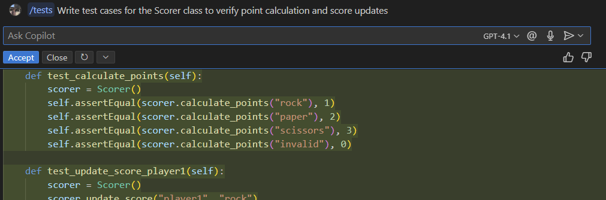

# Rock Paper Scissors: Game Simulation 🏆

In this hands-on lab, you'll build a Python implementation of a classic Rock Paper Scissors game between two players with the help of GitHub Copilot! This lab demonstrates how GitHub Copilot can assist with creating game logic, scoring systems, and user interfaces.

## Lab Overview 📋

**Duration**: 30-45 Minutes  
**Difficulty**: Beginner to Intermediate  
**Prerequisites**:

- Basic knowledge of Python and console applications
- Python 3.8+: [Download Python](https://www.python.org/downloads/)
- pip package manager (included with Python)

## What You'll Build 🏗️

A Python console application that simulates a Rock Paper Scissors match with the following components:

- Game logic for rock, paper, scissors
- Scoring system based on the winning move
- Round-by-round simulation of the match
- Optional advanced features like hints and player move selection

## Getting Started 🚀

### Step 1: Set Up the Project Structure

We'll start by setting up a basic Python project structure. GitHub Copilot will help us create the necessary files and configurations.

!!! tip "Copilot Tip"
     You can ask Github Copilot Chat to provide you with the steps to create a Python based project with a prompt like: ``How can I create a Python based project, where I need one file for the game and another file for the testing?``

     You can use ``@workspace`` agent to 

Let's set up our project directory. Create an empty folder and navigate to it via terminal.

```powershell
mkdir rock_paper_scissors
cd rock_paper_scissors
```

??? note "Optionally, you can create a virtual environment and activate it."
    ```powershell
    python -m venv venv
    # For Windows
    venv\Scripts\activate
    # For macOS/Linux
    # source venv/bin/activate
    ```

A sample project structure could look like this:
```
rock_paper_scissors/
├── game.py
└── tests/
    └── test_game.py
```

### Step 2: Create the Game File - Step by Step

Let's start by creating a single file that contains all the game logic, scoring system, and main application. We'll build this incrementally, introducing GitHub Copilot features along the way.

First, create a new file called `game.py` in your project directory and open the file in your editor.


!!! tip "Copilot Tip"
    Start with a comment describing what you want to build, and GitHub Copilot will suggest code based on your description.
    After typing the comment, press Enter, and Copilot may suggest some initial code.

Let's first create the basic structure for our game by implementing a class, which will include all helpful functions. Try typing the following comment: ``# Class that represents the scorer of the game ``. 

!!! note "You should have the following output in your IDE:"
    ```python
    # Rock Paper Scissors game implementation

    # Class that represents the scorer of the game 
    class Scorer:
    ```

#### Implementing the Scorer Class

Now let's implement the constructor for our `Scorer` class.  

Start typing the following comment and press Tab to accept Copilot's suggestion: ``initialize the scorer with two player scores``.

!!! abstract "Sample Result"
    ```python
    # Class that represents the scorer of the game
    class Scorer:

        # initialize the scorer with two player scores
        def __init__(self):
            self.player1_score = 0
            self.player2_score = 0
    ```

Before implementing a method to update scores, let's implement a method to calculate scores for different winner moves.
Again, use comments to guide Copilot:

!!! tip "Copilot Tip"
     Add a comment describing what the method should do, and Copilot will suggest an implementation. Try typing ``# method to calculate points for the winning move``.

After receiving Copilot's suggestion, your code should now include something like the following.

!!! abstract "Sample Result"
    ```python
    # method to calculate points for the winning move
        def calculate_points(self, move):
            if move == "rock":
                return 1
            elif move == "paper":
                return 2
            elif move == "scissors":
                return 3
            else:
                print("Invalid move")
                return 0
    ```

Now, let's implement a function to update the scores based on the winner and the move. Try adding the following comment: ``# Method to update the score based on the winner and the move``

After typing this, Copilot should suggest the method body. Accept the suggestion by pressing Tab.

!!! abstract "Sample Result"
    ```python
    # Method to update the score based on the winner and the move
        def update_score(self, winner, move):
            points = self.calculate_points(move)
            if winner == "player1":
                self.player1_score += points
            elif winner == "player2":
                self.player2_score += points
            else:
                print("Invalid winner")
    ```

Let's add methods to get the final scores and determine the winner. For this, we'll use Copilot's ability to generate code based on function names.

Simply type the method name and signature, and Copilot will suggest the implementation. Try typing: ``def get_final_scores(self):``

??? abstract "Sample result:"
    ```python
    def get_final_scores(self):
        return self.player1_score, self.player2_score
    ```

You can use the same way to implement a function to determine the winner. Try typing: ``def get_winner(self):``

??? abstract "Sample result:"
    ```python
    def get_winner(self):
            if self.player1_score > self.player2_score:
                return "Player 1 wins!"
            elif self.player2_score > self.player1_score:
                return "Player 2 wins!"
            else:
                return "It's a tie!"
    ```

#### Adding the Game Logic Function

Now let's implement the core game logic with a function to determine the winner of a specific round.

After the `Scorer` class, add a comment and let Copilot suggest the function. Try typing: `# Function to determine the winner of a rock paper scissors round`

Copilot should suggest a function, accept and review it.

??? abstract "Sample Result:"
    ```python
    # Function to determine the winner of a rock paper scissors round
    def determine_winner(player1_move, player2_move):
        if player1_move == player2_move:
            return "tie"
        elif (player1_move == "rock" and player2_move == "scissors") or \
            (player1_move == "paper" and player2_move == "rock") or \
            (player1_move == "scissors" and player2_move == "paper"):
            return "player1"
        else:
            return "player2"
    ```

#### Implementing the Main Game Loop

Finally, let's implement the main game loop that simulates the match:

!!! tip "Copilot Tip"
     For longer functions like the main game loop, you can give Copilot more detailed instructions using comments. Try typing ``def main():`` to receive code recommendations, if Copilot suggests more comments.
     ```python
     # Main function to simulate a 5-round match between Player 1 and Player 2 with predefined moves and score tracking
     # Print out detailed texts, results of each round and the final scores
     ```

Start implementing the `main` function. Here are the predefined moves for the both players:
```python
# player1_moves = ['scissors', 'paper', 'scissors', 'rock', 'rock']
# player2_moves = ['rock', 'rock', 'paper', 'scissors', 'paper']
```

!!! tip "Copilot Tip"
    If you are not satisfied with the overall suggestion of the main function, you can try to modify the comment you have provided.
    
    Or, you can press ``Strg`` and then right arrow to only accept word by word.

Accept Copilot's suggestion for the implementation. It should provide something like the following.

??? abstract "Sample result:"
    ```python
    # Main function to simulate a 5-round match between Player 1 and Player 2 with predefined moves and score tracking
    # Print out detailed texts, results of each round and the final scores
    # predifned moves for Player 1 and Player 2:
    # player1_moves = ['scissors', 'paper', 'scissors', 'rock', 'rock']
    # player2_moves = ['rock', 'rock', 'paper', 'scissors', 'paper']
    def main():
        player1_moves = ['scissors', 'paper', 'scissors', 'rock', 'rock']
        player2_moves = ['rock', 'rock', 'paper', 'scissors', 'paper']
        
        scorer = Scorer()
        
        for i in range(5):
            player1_move = player1_moves[i]
            player2_move = player2_moves[i]
            
            print(f"Round {i + 1}:")
            print(f"Player 1 plays: {player1_move}")
            print(f"Player 2 plays: {player2_move}")
            
            winner = determine_winner(player1_move, player2_move)
            
            if winner == "tie":
                print("It's a tie!")
            else:
                print(f"{winner} wins this round!")
                scorer.update_score(winner, player1_move if winner == "player1" else player2_move)
                initial_scores = scorer.get_final_scores()
                print(f"Initial Scores: Player 1: {initial_scores[0]}, Player 2: {initial_scores[1]}")
            
            print("-" * 30)
        
        final_scores = scorer.get_final_scores()
        print(f"Final Scores: Player 1: {final_scores[0]}, Player 2: {final_scores[1]}")
        print(scorer.get_winner())
    ```

#### Adding the Entry Point

Finally, let's add the entry point to our script:

!!! tip "Copilot Tip"
     For standard Python idioms like the entry point, Copilot often needs minimal prompting. Try typing:
     ```python
     if __name__ == "__main__":
     ```

At this point, your complete `game.py` should look something like the following:

??? abstract "Complete `game.py`"
    ```python
    # Rock Paper Scissors Game

    # Class that represents the scorer of the game
    class Scorer:

        # initialize the scorer with two player scores
        def __init__(self):
            self.player1_score = 0
            self.player2_score = 0

        # method to calculate points for the winning move
        def calculate_points(self, move):
            if move == "rock":
                return 1
            elif move == "paper":
                return 2
            elif move == "scissors":
                return 3
            else:
                print("Invalid move")
                return 0
            
        # Method to update the score based on the winner and the move
        def update_score(self, winner, move):
            points = self.calculate_points(move)
            if winner == "player1":
                self.player1_score += points
            elif winner == "player2":
                self.player2_score += points
            else:
                print("Invalid winner")

        def get_final_scores(self):
            return self.player1_score, self.player2_score
        
        def get_winner(self):
            if self.player1_score > self.player2_score:
                return "Player 1 wins!"
            elif self.player2_score > self.player1_score:
                return "Player 2 wins!"
            else:
                return "It's a tie!"

    # Function to determine the winner of a rock paper scissors round
    def determine_winner(player1_move, player2_move):
        if player1_move == player2_move:
            return "tie"
        elif (player1_move == "rock" and player2_move == "scissors") or \
            (player1_move == "paper" and player2_move == "rock") or \
            (player1_move == "scissors" and player2_move == "paper"):
            return "player1"
        else:
            return "player2"
        
    # Main function to simulate a 5-round match between Player 1 and Player 2 with predefined moves and score tracking
    # Print out detailed texts, results of each round and the final scores
    # predifned moves for Player 1 and Player 2:
    # player1_moves = ['scissors', 'paper', 'scissors', 'rock', 'rock']
    # player2_moves = ['rock', 'rock', 'paper', 'scissors', 'paper']
    def main():
        player1_moves = ['scissors', 'paper', 'scissors', 'rock', 'rock']
        player2_moves = ['rock', 'rock', 'paper', 'scissors', 'paper']
        
        scorer = Scorer()
        
        for i in range(5):
            player1_move = player1_moves[i]
            player2_move = player2_moves[i]
            
            print(f"Round {i + 1}:")
            print(f"Player 1 plays: {player1_move}")
            print(f"Player 2 plays: {player2_move}")
            
            winner = determine_winner(player1_move, player2_move)
            
            if winner == "tie":
                print("It's a tie!")
            else:
                print(f"{winner} wins this round!")
                scorer.update_score(winner, player1_move if winner == "player1" else player2_move)
                initial_scores = scorer.get_final_scores()
                print(f"Initial Scores: Player 1: {initial_scores[0]}, Player 2: {initial_scores[1]}")
            
            print("-" * 30)
        
        final_scores = scorer.get_final_scores()
        print(f"Final Scores: Player 1: {final_scores[0]}, Player 2: {final_scores[1]}")
        print(scorer.get_winner())

    if __name__ == "__main__":
        main()
    ```

### Step 3: Create a Test File - Step by Step

Now let's create a test file to verify our game logic. We'll build this incrementally as well.

First, create a tests directory and a test file. A sample project structure could look like this:
```
rock_paper_scissors/
├── game.py
└── tests/
    └── test_game.py
```

#### Setting Up the Test Structure

Open `tests/test_game.py` in your editor and let's start by setting up the test structure:

!!! tip "Copilot Tip"
     Start by typing a comment describing what the file is for, then import statements. Try typing:
     ```# Tests for the Rock Paper Scissors game```

Copilot should suggest importing your game module.

??? abstract "Sample import structure"
    ```python
    # Tests for the Rock Paper Scissors game
    import unittest
    from game import Scorer, determine_winner
    ```

#### Creating the Test File

Now let's create a test class structure:

Type the class definition and Copilot will suggest the methods. Try typing: ```# Test class for the Scorer class```

??? abstract "Sample test class structure"
    ```python
    # Test class for the Scorer class
    class TestGame(unittest.TestCase):
    ```

Let's add our first test method to test the `determine_winner` function. 

Use Copilot to generate test cases by either typing a comment beforehand, or by typing the method name.

Accept Copilot's suggestions for the test cases, and make sure the tests align with your game implementation.

??? abstract "Sample test method for `determine_winner`"
    ```python
    # test the determine_winner function
        def test_determine_winner(self):
            self.assertEqual(determine_winner("rock", "scissors"), "player1")
            self.assertEqual(determine_winner("paper", "rock"), "player1")
            self.assertEqual(determine_winner("scissors", "paper"), "player1")

            self.assertEqual(determine_winner("rock", "paper"), "player2")
            self.assertEqual(determine_winner("paper", "scissors"), "player2")
            self.assertEqual(determine_winner("scissors", "rock"), "player2")

            self.assertEqual(determine_winner("rock", "rock"), "tie")
            self.assertEqual(determine_winner("paper", "paper"), "tie")
            self.assertEqual(determine_winner("scissors", "scissors"), "tie")
    ```

Now let's add a test method for the `Scorer` class.

!!! tip "Copilot Tip"
     For more complex test cases, you can use Copilot's `/tests` command leveraging the inline chat function.

In the editor, press Ctrl+I to open the **inline chat** and type:
`/tests Write test cases for the Scorer class to verify point calculation and score updates`

The GHCP inline chat looks like below:

{ width=500px }

You can iterate to get a better result, ask to fix a code that you have written, or even ask to understand a unclear code snippet. Explore pre-written prompts by typing ``/``, e.g. ``/tests``.

After receiving Copilot's suggestions, you can adapt them to your code. 

Your test method for the scorer class can look below.

??? abstract "Sample tests for the scorer class"
    ```python
    # used inline GHCP chat with the following prompt:
        # /tests Write test cases for the Scorer class to verify point calculation and score updates
        def test_calculate_points(self):
            scorer = Scorer()
            self.assertEqual(scorer.calculate_points("rock"), 1)
            self.assertEqual(scorer.calculate_points("paper"), 2)
            self.assertEqual(scorer.calculate_points("scissors"), 3)
            self.assertEqual(scorer.calculate_points("invalid"), 0)

        def test_update_score_player1(self):
            scorer = Scorer()
            scorer.update_score("player1", "rock")
            self.assertEqual(scorer.player1_score, 1)
            self.assertEqual(scorer.player2_score, 0)
            scorer.update_score("player1", "paper")
            self.assertEqual(scorer.player1_score, 3)
            self.assertEqual(scorer.player2_score, 0)

        def test_update_score_player2(self):
            scorer = Scorer()
            scorer.update_score("player2", "scissors")
            self.assertEqual(scorer.player1_score, 0)
            self.assertEqual(scorer.player2_score, 3)
            scorer.update_score("player2", "rock")
            self.assertEqual(scorer.player1_score, 0)
            self.assertEqual(scorer.player2_score, 4)

        def test_update_score_invalid(self):
            scorer = Scorer()
            scorer.update_score("invalid", "rock")
            self.assertEqual(scorer.player1_score, 0)
            self.assertEqual(scorer.player2_score, 0)

        def test_get_final_scores(self):
            scorer = Scorer()
            scorer.update_score("player1", "rock")
            scorer.update_score("player2", "paper")
            self.assertEqual(scorer.get_final_scores(), (1, 2))

        def test_get_winner(self):
            scorer = Scorer()
            scorer.update_score("player1", "rock")  # 1
            scorer.update_score("player2", "paper") # 2
            self.assertEqual(scorer.get_winner(), "Player 2 wins!")
            scorer.update_score("player1", "scissors") # +3, total 4
            self.assertEqual(scorer.get_winner(), "Player 1 wins!")
            scorer = Scorer()
            self.assertEqual(scorer.get_winner(), "It's a tie!")
    ```

Finally, let's add the code to run the tests:
!!! abstract "Complete the file with:"
    ```python
    if __name__ == '__main__':
        unittest.main()
    ```

At this point, your complete `test_game.py` can look like this:

??? abstract "Sample `test_game.py`"
    ```python
    # Tests for the Rock Paper Scissors game
    import unittest
    from game import Scorer, determine_winner

    # Test class for the Scorer class
    class TestGame(unittest.TestCase):
        
        # test the determine_winner function
        def test_determine_winner(self):
            self.assertEqual(determine_winner("rock", "scissors"), "player1")
            self.assertEqual(determine_winner("paper", "rock"), "player1")
            self.assertEqual(determine_winner("scissors", "paper"), "player1")
            self.assertEqual(determine_winner("rock", "paper"), "player2")
            self.assertEqual(determine_winner("paper", "scissors"), "player2")
            self.assertEqual(determine_winner("scissors", "rock"), "player2")
            self.assertEqual(determine_winner("rock", "rock"), "tie")
            self.assertEqual(determine_winner("paper", "paper"), "tie")
            self.assertEqual(determine_winner("scissors", "scissors"), "tie")
        
        # used inline GHCP chat with the following prompt:
        # /tests Write test cases for the Scorer class to verify point calculation and score updates
        def test_calculate_points(self):
            scorer = Scorer()
            self.assertEqual(scorer.calculate_points("rock"), 1)
            self.assertEqual(scorer.calculate_points("paper"), 2)
            self.assertEqual(scorer.calculate_points("scissors"), 3)
            self.assertEqual(scorer.calculate_points("invalid"), 0)

        def test_update_score_player1(self):
            scorer = Scorer()
            scorer.update_score("player1", "rock")
            self.assertEqual(scorer.player1_score, 1)
            self.assertEqual(scorer.player2_score, 0)
            scorer.update_score("player1", "paper")
            self.assertEqual(scorer.player1_score, 3)
            self.assertEqual(scorer.player2_score, 0)

        def test_update_score_player2(self):
            scorer = Scorer()
            scorer.update_score("player2", "scissors")
            self.assertEqual(scorer.player1_score, 0)
            self.assertEqual(scorer.player2_score, 3)
            scorer.update_score("player2", "rock")
            self.assertEqual(scorer.player1_score, 0)
            self.assertEqual(scorer.player2_score, 4)

        def test_update_score_invalid(self):
            scorer = Scorer()
            scorer.update_score("invalid", "rock")
            self.assertEqual(scorer.player1_score, 0)
            self.assertEqual(scorer.player2_score, 0)

        def test_get_final_scores(self):
            scorer = Scorer()
            scorer.update_score("player1", "rock")
            scorer.update_score("player2", "paper")
            self.assertEqual(scorer.get_final_scores(), (1, 2))

        def test_get_winner(self):
            scorer = Scorer()
            scorer.update_score("player1", "rock")  # 1
            scorer.update_score("player2", "paper") # 2
            self.assertEqual(scorer.get_winner(), "Player 2 wins!")
            scorer.update_score("player1", "scissors") # +3, total 4
            self.assertEqual(scorer.get_winner(), "Player 1 wins!")
            scorer = Scorer()
            self.assertEqual(scorer.get_winner(), "It's a tie!")


    # main function to run the tests
    if __name__ == '__main__':
        unittest.main()
    ```

#### Running the Tests

Now let's run the tests to verify that our game logic is working correctly.

In your game folder, run the following command.

!!! "Run the tests with these command:"
    ```powershell
    python -m unittest discover tests
    ```

If all tests pass, you should see output similar to:
```
.....
----------------------------------------------------------------------
Ran 2 tests in 0.001s

OK
```

### Step 4: Run the Game

Now, let's run the game to see the simulation in action:

```powershell
python game.py
```

### Step 5: Advanced Features (Optional)

If you have time, try implementing these advanced features:

!!! tip "Copilot Tip"
     Ask Github Copilot to help you implement these advanced features by describing what you want to achieve.

1. **Hint System**: Add a hint system that suggests a move to the player

2. **Player Input**: Allow players to select their moves for each round

3. **GUI Interface**: Create a simple graphical interface using a library like Pygame or Tkinter

## GitHub Copilot Tips 💡

### Use Copilot to improve efficiency

See if you can use Copilot to find out the complexity (BigO notation) of the code.

1. Open the GitHub Copilot Chat view in the sidebar if it's not already open. Make sure your solution file is still open as well.

2. Ask Copilot Chat what the complexity of the code is.

3. Ask Copilot Chat to make the code more efficient.

4. Ask for the complexity again - is it better?

### Use Copilot to generate code comments

1. Highlight all of the code with Ctrl/Cmd+A.

2. Press Ctrl/Cmd+I to open the inline chat.

3. Type ``/doc``

4. Ask Copilot Chat to document the function.

### Use Copilot to simplify your code

1. Open GitHub Copilot Chat in the sidebar, and ask it to make your code simpler.

2. What did Copilot Chat suggest you do to make it simpler?

### Got Errors?

Copilot Chat can help with that too! Just copy the error message and paste it into Chat. Often that's all Copilot needs to resolve your issue. If you iterate with the **Agent Mode**, GHCP can also see your error messages in the terminal and directly modify your code accordingly.

## Summary 📝

In this lab, you've learned how to:

- Use GitHub Copilot to create a Rock Paper Scissors game simulation
- Implement game logic and scoring systems in Python
- Simulate a multi-round match with predefined moves
- Determine the winner based on accumulated points
- Generate tests for the implemented game

GitHub Copilot has helped you write code faster and with less effort, allowing you to focus on the game design rather than the implementation details. This is a great example of how AI-assisted coding can enhance your development workflow! 🚀

## Bonus Challenges 🌟

If you've completed the lab and want an extra challenge, try:

1. Implementing different scoring rules
2. Adding more players to the game
3. Creating a tournament system with multiple matches
4. Adding sound effects for each move
