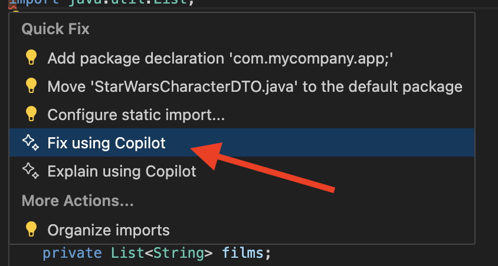

# Star Wars API Client Lab with Python 🚀

In this hands-on lab, you'll build a Python client for the Star Wars API (SWAPI) with the help of GitHub Copilot! This lab demonstrates how GitHub Copilot can assist with creating data classes, abstract base classes, implementations, and tests in Python.

## Lab Overview 📋

**Duration**: 1 hour  
**Difficulty**: Intermediate  
**Prerequisites**:

- Basic knowledge of Python, REST APIs, and unit testing  
- Python 3.8+: [Download Python](https://www.python.org/downloads/)
- pip package manager (included with Python)

## What You'll Build 🏗️

A Python client for the Star Wars API with the following components:

- Data Classes to represent Star Wars characters
- An abstract base class defining the API client methods
- An implementation of the abstract base class using Python's requests library
- Unit tests to verify the functionality

## Getting Started 🚀

### Step 1: Set Up the Project Structure

We'll start by setting up a basic Python project structure. GitHub Copilot will help us create the necessary files and configurations.

!!! tip "Copilot Tip"
     You can ask Github Copilot Chat to provide you with the steps to create a Python based project with a prompt like: ``How can I create a Python based project with unit tests?``

Let's set up our project directory. Create an empty folder and navigate to it via terminal.

```bash
mkdir starwarsapi-python
cd starwarsapi-python
```

Create a virtual environment and activate it:

```bash
python -m venv venv
# For Windows
venv\Scripts\activate
# For macOS/Linux
source venv/bin/activate
```

A sample project structure could look like this:
```
starwarsapi-python/
├── requirements.txt
├── src/
│   ├── app.py
│   ├── star_wars_api.py
│   ├── star_wars_api_impl.py
│   └── star_wars_character.py
└── tests/
    └── test_star_wars_api.py
```

### Step 2: Install Required Packages

Let's create a `requirements.txt` file with the necessary dependencies.

!!! tip "Copilot Tip"
     Ask GitHub Copilot to help you create a requirements.txt file with dependencies for HTTP requests and unit testing.

Ensure that the dependency versions align with your project requirements, after using Copilot for creating the dependencies.

Your `requirements.txt` could look something like this:

```
requests==2.31.0
pytest==7.4.0
pytest-cov==4.1.0
```

Install the dependencies:

```bash
pip install -r requirements.txt
```

### Step 3: Create the Data Class for Star Wars Character

!!! info
    This demonstration can be implemented through different methods. Originally, this demonstration is adapted from a [Java version](starwars-api.md), that's why you may notice some Java-inspired structures. Feel free to experiment with different Python approaches and ask GitHub Copilot for suggestions or alternative implementations as you work through the lab.

Please navigate in your browser to the [Star Wars API](https://swapi.info/) and get familiar with the API. We will create a data class to represent a Star Wars Character.

Let's start by using Luke Skywalker as an example: [https://swapi.info/people/1](https://swapi.info/people/1)

??? note "Please copy the JSON in your clipboard:"
    ```json
    {  
        "name": "Luke Skywalker",
        "height": "172",
        "mass": "77",
        "hair_color": "blond",
        "skin_color": "fair",
        "eye_color": "blue",
        "birth_year": "19BBY",
        "gender": "male",
        "homeworld": "https://swapi.info/api/planets/1",
        "films": [
            "https://swapi.info/api/films/1",
            "https://swapi.info/api/films/2",
            "https://swapi.info/api/films/3",
            "https://swapi.info/api/films/6"
        ],
        "species": [],
        "vehicles": [
            "https://swapi.info/api/vehicles/14",
            "https://swapi.info/api/vehicles/30"
        ],
        "starships": [
            "https://swapi.info/api/starships/12",
            "https://swapi.info/api/starships/22"
        ],
        "created": "2014-12-09T13:50:51.644000Z",
        "edited": "2014-12-20T21:17:56.891000Z",
        "url": "https://swapi.info/api/people/1"
    }
    ```

Now, let's create a data class to represent a Star Wars character.

!!! tip "Copilot Tip"
     Create a `star_wars_character.py` file and use Github Copilot Ask/Edit mode to create a data class for the Star Wars Character. You can use the JSON payload above as an example payload within the prompt.

Remember that you can directly create files out of Copilot chat by clicking on the three dots icon and then clicking `Insert into New File`, if you are using the Ask mode:

 { width=400px }

Below is a sample implementation for `star_wars_character.py`.

??? abstract "Sample Solution"
    ```python
    from dataclasses import dataclass
    from typing import List


    @dataclass
    class StarWarsCharacter:
        """Data class for Star Wars character from SWAPI"""
        name: str
        height: str
        mass: str
        hair_color: str
        skin_color: str
        eye_color: str
        birth_year: str
        gender: str
        homeworld: str
        films: List[str]
        species: List[str]
        vehicles: List[str]
        starships: List[str]
        created: str
        edited: str
        url: str

        @classmethod
        def from_dict(cls, data: dict) -> 'StarWarsCharacter':
            """Create a StarWarsCharacter from a dictionary"""
            return cls(
                name=data.get('name', ''),
                height=data.get('height', ''),
                mass=data.get('mass', ''),
                hair_color=data.get('hair_color', ''),
                skin_color=data.get('skin_color', ''),
                eye_color=data.get('eye_color', ''),
                birth_year=data.get('birth_year', ''),
                gender=data.get('gender', ''),
                homeworld=data.get('homeworld', ''),
                films=data.get('films', []),
                species=data.get('species', []),
                vehicles=data.get('vehicles', []),
                starships=data.get('starships', []),
                created=data.get('created', ''),
                edited=data.get('edited', ''),
                url=data.get('url', '')
            )
    ```

!!! tip "Copilot Tip"
    If you are facing an error, you can ask Github Copilot to help you fix the error.

    On Mac press ``CMD + .`` and on Windows press ``Control + .`` to open the **quick fix menu** and use the Github Copilot to fix the error.
    
    Quick fix menu should look like this:

    { width=400px }

### Step 4: Create the API Abstract Base Class (Interface)

We will create an abstract base class (interface in Java) that will be used to query the Star Wars API. The abstract base class will have a method that will return a `StarWarsCharacter` object.

!!! tip "Copilot Tip"
     Create a new file called `star_wars_api.py` file and use Github Copilot chat to create a Python abstract base class for the Star Wars API. We need to have a method that returns Luke Skywalker as a `StarWarsCharacter` object.

??? note "Sample Prompt for Copilot"
    ``Can you help me create a plain python abstract base class that queries the Star Wars API and returns a StarWarsCharacter object? I would like to start with just one method for querying Luke Skywalker. The abstract base class should be called StarWarsAPI.``

Here's a sample implementation for `star_wars_api.py`:

??? abstract "Sample Solution"
    ```python
    from abc import ABC, abstractmethod
    from star_wars_character import StarWarsCharacter


    class StarWarsAPI(ABC):
        """Abstract Base Class for Star Wars API client"""
        
        @abstractmethod
        def get_luke_skywalker(self) -> StarWarsCharacter:
            """
            Get Luke Skywalker's information
            Returns:
                StarWarsCharacter: Luke Skywalker's data
            Raises:
                Exception: If an error occurs while fetching the data
            """
            pass
    ```

### Step 5: Create a Test for the StarWarsAPI Abstract Base Class

We will now create a test for the `StarWarsAPI` abstract base class. The test will be used to verify that the abstract base class is working as expected. We will use pytest to create the test.

!!! tip "Copilot Tip"
     Open the `test_star_wars_api.py` file in the tests folder and use Github Copilot to create a test for the `StarWarsAPI` abstract base class. Use the `/tests` command to let Copilot generate the test for you.

Here's a sample implementation for `test_star_wars_api.py`:

??? abstract "Sample Solution"
    ```python
    import pytest
    from src.starwarsapi.star_wars_api_impl import StarWarsAPIImpl
    from src.starwarsapi.star_wars_character import StarWarsCharacter


    def test_get_luke_skywalker():
        """Test that get_luke_skywalker returns Luke Skywalker's data"""
        star_wars_api = StarWarsAPIImpl()
        luke_skywalker = star_wars_api.get_luke_skywalker()
        
        assert luke_skywalker is not None
        assert luke_skywalker.name == "Luke Skywalker"
        assert luke_skywalker.height == "172"
        assert luke_skywalker.gender == "male"
    ```

If you run tests now, you will run into errors. You will see that the `StarWarsAPIImpl` class is not yet created. We will implement it in the next step.

### Step 6: Implement the API abstract base class

Now, let's implement the abstract base class using Python's requests library.

We will first create the `StarWarsAPIImpl` class that implements the `StarWarsAPI` abstract base class. The class will have a method that will return a `StarWarsCharacter` object. As we need to have a start, we will use the Luke Skywalker example and also use a method to query specificly for Luke Skywalker.

!!! tip "Copilot Tip"
     Create a new file `star_wars_api_impl.py` file and use Github Copilot to implement the `StarWarsAPI` abstract base class. The implementation should use the requests library to fetch data from the Star Wars API.

Here's a sample implementation for `star_wars_api_impl.py`:

??? abstract "Sample solution"
    ```python
    from star_wars_api import StarWarsAPI
    from star_wars_character import StarWarsCharacter


    class StarWarsAPIImpl(StarWarsAPI):
        """Implementation of the Star Wars API client"""
        
        def __init__(self):
            self.base_url = "https://swapi.info/api"
        
        def get_luke_skywalker(self) -> StarWarsCharacter:
        """
        Get Luke Skywalker's information
        """
    ```

We will now implement the `get_luke_skywalker` method in the `StarWarsAPIImpl` class. We will use `requests` library to query the Star Wars API and retrieve the information about Luke Skywalker from the URL: [https://swapi.info/api/people/1](https://swapi.info/api/people/1)

The method should be able to fulfill the following points:

- Import the `requests` library
- Build the URL for Luke Skywalker (`https://swapi.info/api/people/1/`)
- Make a GET request to the API
- Parse the response JSON into a `StarWarsCharacter` object
- Return the `StarWarsCharacter` object

!!! tip "Sample Prompts"
    You can use the following prompts one by one to implement the method. Accept the suggestions by pressing `Tab`:

    - `# Import the requests library`
    - `# Build the URL for Luke Skywalker`
    - `# Make a GET request to the Star Wars API`
    - `# Parse the response JSON into a StarWarsCharacter object`
    - `# Return the StarWarsCharacter object`

??? abstract "Sample Solution"
    ```python
    import requests
    from star_wars_api import StarWarsAPI
    from star_wars_character import StarWarsCharacter


    class StarWarsAPIImpl(StarWarsAPI):
        """Implementation of the Star Wars API client"""
        
        def __init__(self):
            self.base_url = "https://swapi.info/api"
        
        def get_luke_skywalker(self) -> StarWarsCharacter:
            """
            Get Luke Skywalker's information
            Returns:
                StarWarsCharacter: Luke Skywalker's data
            Raises:
                Exception: If an error occurs while fetching the data
            """
            # Build the URL for Luke Skywalker
            url = f"{self.base_url}/people/1/"

            # Make a GET request to the Star Wars API
            response = requests.get(url, allow_redirects=True)

            # Raise an exception for HTTP errors
            response.raise_for_status()  

            # Parse the response JSON into a StarWarsCharacter object
            return StarWarsCharacter.from_dict(response.json())
    ```

Now let's run the test to see if it works:

```bash
python -m pytest tests/
```

If you encounter any issues, you might need to fix the URL. The SWAPI URL sometimes changes, so make sure you're using the correct one. It could be `https://swapi.dev/api` or `https://swapi.info/api`.

### Optional: Add a Method for Darth Vader

We will now implement the `getDarthVader` method in the `StarWarsAPIImpl` class. We will use `requests` to query the Star Wars API and retrieve the information about Darth Vader from the url: [https://swapi.info/api/people/4](https://swapi.info/api/people/4)

!!! tip "Copilot Tip"
     Add a new method to the `StarWarsAPI` abstract base class and implement it in the `StarWarsAPIImpl` class.
     
     Either use a comment or **the Copilot Edit/Agent mode** with a prompt: `Add a method to get information about Darth Vader`.

First, add the method to the abstract base class in `star_wars_api.py`:

??? abstract "Sample Solution"
    ```python
    from abc import ABC, abstractmethod
    from star_wars_character import StarWarsCharacter


    class StarWarsAPI(ABC):
        """abstract base class for Star Wars API client"""
        
        @abstractmethod
        def get_luke_skywalker(self) -> StarWarsCharacter:
            """
            Get Luke Skywalker's information
            Returns:
                StarWarsCharacter: Luke Skywalker's data
            Raises:
                Exception: If an error occurs while fetching the data
            """
            pass
        
        @abstractmethod
        def get_darth_vader(self) -> StarWarsCharacter:
            """
            Get Darth Vader's information
            Returns:
                StarWarsCharacter: Darth Vader's data
            Raises:
                Exception: If an error occurs while fetching the data
            """
            pass
    ```

Then, implement the `get_darth_vader` method in `star_wars_api_impl.py`:

??? abstract "Sample Solution"
    ```python
    import requests
    from star_wars_api import StarWarsAPI
    from star_wars_character import StarWarsCharacter


    class StarWarsAPIImpl(StarWarsAPI):
        """Implementation of the Star Wars API client"""
        
        def __init__(self):
            self.base_url = "https://swapi.info/api"
        
        def get_luke_skywalker(self) -> StarWarsCharacter:
            """
            Get Luke Skywalker's information
            Returns:
                StarWarsCharacter: Luke Skywalker's data
            Raises:
                Exception: If an error occurs while fetching the data
            """
            url = f"{self.base_url}/people/1/"
            response = requests.get(url, allow_redirects=True)
            response.raise_for_status()  # Raise an exception for HTTP errors
            
            return StarWarsCharacter.from_dict(response.json())
        
        def get_darth_vader(self) -> StarWarsCharacter:
            """
            Get Darth Vader's information
            Returns:
                StarWarsCharacter: Darth Vader's data
            Raises:
                Exception: If an error occurs while fetching the data
            """
            url = f"{self.base_url}/people/4/"
            response = requests.get(url, allow_redirects=True)
            response.raise_for_status()  # Raise an exception for HTTP errors
            
            return StarWarsCharacter.from_dict(response.json())
    ```

Since we have duplicate code now, let's refactor the code.

!!! tip "Copilot Tip"
    Add a method ``_get_star_wars_character(self, character_id)`` and let Copilot help you refactor.

??? abstract "Sample Solution After Refactoring"
    ```python
    import requests
    from star_wars_api import StarWarsAPI
    from star_wars_character import StarWarsCharacter


    class StarWarsAPIImpl(StarWarsAPI):
        """Implementation of the Star Wars API client"""
        
        def __init__(self):
            self.base_url = "https://swapi.info/api"
        
        def get_luke_skywalker(self) -> StarWarsCharacter:
            """
            Get Luke Skywalker's information
            Returns:
                StarWarsCharacter: Luke Skywalker's data
            Raises:
                Exception: If an error occurs while fetching the data
            """
            return self._get_star_wars_character(1)
        
        def get_darth_vader(self) -> StarWarsCharacter:
            """
            Get Darth Vader's information
            Returns:
                StarWarsCharacter: Darth Vader's data
            Raises:
                Exception: If an error occurs while fetching the data
            """
            return self._get_star_wars_character(4)
        
        def _get_star_wars_character(self, character_id: int) -> StarWarsCharacter:
            """
            Get a Star Wars character by ID
            Args:
                character_id: The ID of the character to fetch
            Returns:
                StarWarsCharacter: The character data
            Raises:
                Exception: If an error occurs while fetching the data
            """
            url = f"{self.base_url}/people/{character_id}/"
            response = requests.get(url, allow_redirects=True)
            response.raise_for_status()  # Raise an exception for HTTP errors
            
            return StarWarsCharacter.from_dict(response.json())
    ```

### Optional: Add a Test for the Darth Vader Method

Now let's add a test for the `get_darth_vader` method:

!!! tip "Copilot Tip"
     Add a new test method to the `test_star_wars_api.py` file that will test the `get_darth_vader` method. You can use a comment as a prompt to do so: `# Test the get_darth_vader method`

Here's a sample test method to add to `test_star_wars_api.py`:

??? abstract "Sample Solution"
    ```python
    def test_get_darth_vader():
        """Test that get_darth_vader returns Darth Vader's data"""
        star_wars_api = StarWarsAPIImpl()
        darth_vader = star_wars_api.get_darth_vader()
        
        assert darth_vader is not None
        assert darth_vader.name == "Darth Vader"
        assert darth_vader.height == "202"
        assert darth_vader.gender == "male"
    ```

Run the test again to make sure it passes:

```bash
python -m pytest tests/
```

### Step 9: Create a Simple App Module

Let's create a simple application module to demonstrate the API client:

!!! tip "Copilot Tip"
     Open the `app.py` file and use Github Copilot to create a simple application that demonstrates the Star Wars API client.

Here's a sample implementation for `app.py`:

??? abstract "Sample Solution"
    ```python
    from star_wars_api_impl import StarWarsAPIImpl


    def main():
        """Main function to demonstrate the Star Wars API client"""
        print("Star Wars API Client")
        print("--------------------")
        
        api = StarWarsAPIImpl()
        
        # Get Luke Skywalker
        luke = api.get_luke_skywalker()
        print(f"\nName: {luke.name}")
        print(f"Height: {luke.height} cm")
        print(f"Mass: {luke.mass} kg")
        print(f"Hair color: {luke.hair_color}")
        print(f"Appears in {len(luke.films)} films")
        
        # Get Darth Vader
        vader = api.get_darth_vader()
        print(f"\nName: {vader.name}")
        print(f"Height: {vader.height} cm")
        print(f"Mass: {vader.mass} kg")
        print(f"Hair color: {vader.hair_color}")
        print(f"Appears in {len(vader.films)} films")


    if __name__ == "__main__":
        main()
    ```

Run the application:

```bash
python app.py
```

You should see output similar to this:

```
Star Wars API Client
--------------------

Name: Luke Skywalker
Height: 172 cm
Mass: 77 kg
Hair color: blond
Appears in 4 films

Name: Darth Vader
Height: 202 cm
Mass: 136 kg
Hair color: none
Appears in 4 films
```

## Bonus Challenges 🌟

If you have extra time, try these bonus challenges with GitHub Copilot:

1. Add a method to get information about a character by name (hint: you'll need to use the search endpoint)
2. Add a method to get information about a planet
3. Add a method to get all characters from a specific film
4. Implement caching to avoid making the same API calls repeatedly

## Summary 📝

In this lab, you've learned how to:

- Use GitHub Copilot to create a Python client for a REST API
- Create data classes, abstract base classes, and implementations in Python
- Write unit tests to verify functionality
- Use Python's requests library to make API calls

GitHub Copilot has helped you write code faster and with less effort, allowing you to focus on the design and architecture rather than the implementation details. This is a great example of how AI-assisted coding can enhance your development workflow, especially when working with external APIs! 🚀
