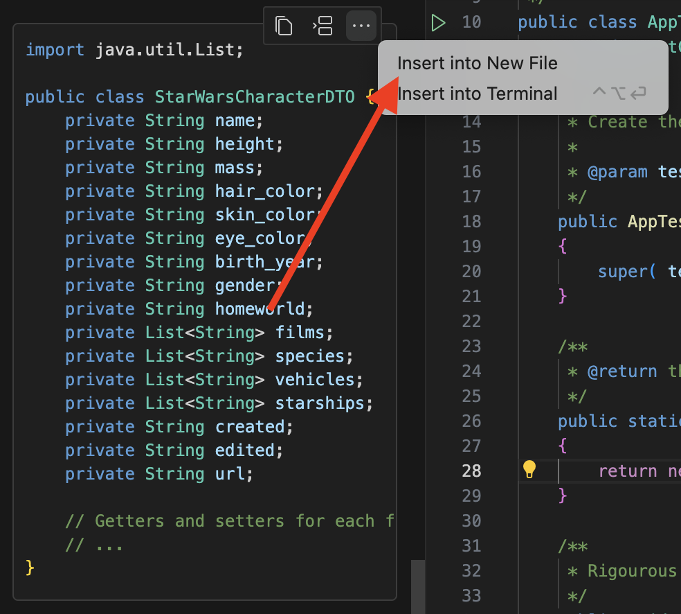
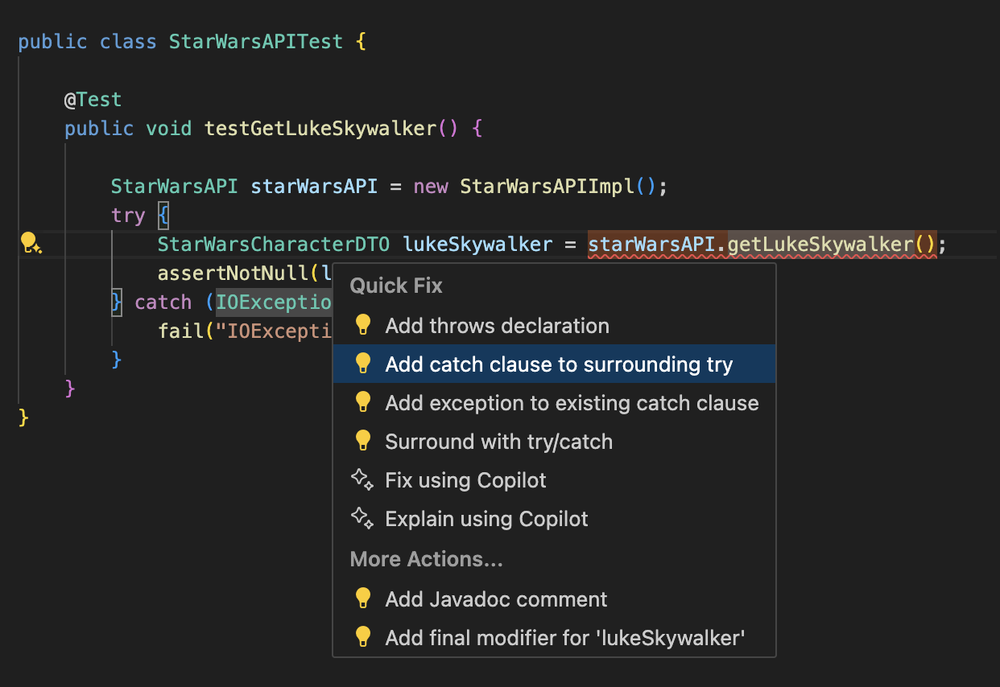

# Star Wars API Client Lab 🚀

In this hands-on lab, you'll build a Java client for the Star Wars API (SWAPI) with the help of GitHub Copilot! This lab demonstrates how GitHub Copilot can assist with creating DTOs, interfaces, implementations, and tests.

## Lab Overview 📋

**Duration**: 1 hour  
**Difficulty**: Intermediate  
**Prerequisites**:

- Basic knowledge of Java, REST APIs, and unit testing  
- OpenJDK: [OpenJDK JDK 21.0.2 GA Release (java.net)](https://jdk.java.net/21/)
- Maven: [Maven – Installing Apache Maven](https://maven.apache.org/install.html)

## What You'll Build 🏗️

A Java client for the Star Wars API with the following components:

- Data Transfer Objects (DTOs) to represent Star Wars characters
- An interface defining the API client methods
- An implementation of the interface using Java's HTTP client
- Unit tests to verify the functionality

## Getting Started 🚀

### Step 1: Set Up the Project Structure

We'll start by setting up a basic Maven project structure. GitHub Copilot will help us create the necessary files and configurations.

!!! tip "Copilot Tip"
     If you're using an IDE like IntelliJ or VS Code, you can create a new Maven project using the built-in tools. Otherwise, you can use the Maven command-line tools to create a new project.
     
     You can also ask Github Copilot Chat to provide you with the steps to create a Maven based Java project, with a prompt like ``How can I create via terminal a Java based project that already has some unit tests?``

Remember hat you can directly copy commands from the chat and paste them into the terminal using the terminal icon:


If you want to use Maven command-line tools to create a new project, create an empty folder and navigate to it via terminal. Then run the following command:

```bash
mvn archetype:generate -DgroupId=com.mycompany.app -DartifactId=my-app -DarchetypeArtifactId=maven-archetype-quickstart -DinteractiveMode=false
```

Ask Github Copilot to provide you with the command to compile the tests, by using the following sample prompt: ``How can I use maven to run the tests?``

Your project should have the following structure:
```
starwarsapi/
├── pom.xml
├── src/
│   ├── main/
│   │   └── java/
│   │       └── com/
│   │           └── mycompany/
│   │               └── app/
│   │                   ├── App.java
│   │                   ├── StarWarsAPI.java
│   │                   ├── StarWarsAPIImpl.java
│   │                   └── StarWarsCharacterDTO.java
│   └── test/
│       └── java/
│           └── com/
│               └── mycompany/
│                   └── app/
│                       ├── AppTest.java
│                       └── StarWarsAPITest.java
```

Navigate in the folder where the project was created and run the following command:

```bash
mvn test
```

You should see the following output:

```bash
[INFO]
[INFO] Tests run: 1, Failures: 0, Errors: 0, Skipped: 0
[INFO] ------------------------------------------------------------------------
[INFO] BUILD SUCCESS
[INFO] ------------------------------------------------------------------------
[INFO] Total time:  1.682 s
```

### Step 2: Create the Maven POM File

Let's start by creating a `pom.xml` file with the necessary dependencies.

!!! tip "Copilot Tip"
     Ask GitHub Copilot to help you create a Maven POM file with dependencies for HTTP client and JSON parsing. Ask Github Copilot how you can leverage Junit 4 instead of Junit 3.

Your `pom.xml` should look something like below.

??? abstract "Sample `pom.xml`"
    ```xml
    <project xmlns="http://maven.apache.org/POM/4.0.0" xmlns:xsi="http://www.w3.org/2001/XMLSchema-instance"
    xsi:schemaLocation="http://maven.apache.org/POM/4.0.0 http://maven.apache.org/maven-v4_0_0.xsd">
    <modelVersion>4.0.0</modelVersion>
    <groupId>com.mycompany.app</groupId>
    <artifactId>starwarsapi</artifactId>
    <packaging>jar</packaging>
    <version>1.0-SNAPSHOT</version>
    <name>starwarsapi</name>
    <url>http://maven.apache.org</url>
    <properties>
        <maven.compiler.source>11</maven.compiler.source>
        <maven.compiler.target>11</maven.compiler.target>
        <project.build.sourceEncoding>UTF-8</project.build.sourceEncoding>
    </properties>
    <dependencies>
        <dependency>
        <groupId>junit</groupId>
        <artifactId>junit</artifactId>
        <version>4.13.2</version>
        <scope>test</scope>
        </dependency>
        <dependency>
        <groupId>com.fasterxml.jackson.core</groupId>
        <artifactId>jackson-databind</artifactId>
        <version>2.13.0</version>
        </dependency>
    </dependencies>
    </project>
    ```

#### Refactor the Tests to Use JUnit 4

Ask Github Copilot to provide you with the necessary imports to use Junit 4 in your tests. Open your `AppTest.java` file in an editor and use Copilot Chat with an appropriate prompt to refactor the class.

!!! tip "Copilot Tip"
    Use the following prompt: ``I would like to refactor the tests to use Junit 4 and one basic test. The test should leverage the @Test annotation. Can you help me with the imports and the overall class structure?``

Your `AppTest.java` file should look like the following sample solution. Be careful with the package name, **it should match the one you used when creating the project**.

??? abstract "Sample Solution"
    ```java

    package com.mycompany.app;

    import org.junit.Test;
    import static org.junit.Assert.*;

    /**
    * Unit test for simple App.
    */
    public class AppTest 
    {

        @Test
        public void testApp()
        {
            assertTrue( true );
        }
    }
    ```

### Step 3: Create the Data Transfer Object (DTO)

Please navigate in your browser to the [Star Wars API](https://swapi.info/) and get familiar with the API. We will create a DTO class to represent a Star Wars Person.

Let's start by using Luke Skywalker as an example: [https://swapi.info/people/1](https://swapi.info/people/1)

You can see the example payload directly at the page. 

??? note "Please copy the JSON in your clipboard:"
    ```json
    {  
        "name": "Luke Skywalker",
        "height": "172",
        "mass": "77",
        "hair_color": "blond",
        "skin_color": "fair",
        "eye_color": "blue",
        "birth_year": "19BBY",
        "gender": "male",
        "homeworld": "https://swapi.info/api/planets/1",
        "films": [
            "https://swapi.info/api/films/1",
            "https://swapi.info/api/films/2",
            "https://swapi.info/api/films/3",
            "https://swapi.info/api/films/6"
        ],
        "species": [],
        "vehicles": [
            "https://swapi.info/api/vehicles/14",
            "https://swapi.info/api/vehicles/30"
        ],
        "starships": [
            "https://swapi.info/api/starships/12",
            "https://swapi.info/api/starships/22"
        ],
        "created": "2014-12-09T13:50:51.644000Z",
        "edited": "2014-12-20T21:17:56.891000Z",
        "url": "https://swapi.info/api/people/1"
    }
    ```

Now, let's create a DTO to represent a Star Wars character.

!!! tip "Copilot Tip"
     Create a new file called `StarWarsCharacterDTO.java` and use Github Copilot chat to create a DTO class for the Star Wars Person. You can use the JSON payload above as an example payload within the prompt.

 Remember that you can directly create files out of Copilot chat by clicking on the three dots icon and then clicking `Insert into New File`, if you are using the Ask mode:

 { width=400px }

??? abstract "Sample solution"
    ```java
    package com.mycompany.app;

    import com.fasterxml.jackson.annotation.JsonIgnoreProperties;
    import com.fasterxml.jackson.annotation.JsonProperty;

    /**
    * Data Transfer Object for Star Wars character from SWAPI
    */
    @JsonIgnoreProperties(ignoreUnknown = true)
    public class StarWarsCharacterDTO {
        private String name;
        private String height;
        private String mass;
        @JsonProperty("hair_color")
        private String hair_color;
        @JsonProperty("skin_color")
        private String skinColor;
        @JsonProperty("eye_color")
        private String eye_color;
        @JsonProperty("birth_year")
        private String birthYear;
        private String gender;
        private String homeworld;
        private String[] films;
        private String[] species;
        private String[] vehicles;
        private String[] starships;
        private String created;
        private String edited;
        private String url;

        // Getters and setters
        public String getName() {
            return name;
        }

        public void setName(String name) {
            this.name = name;
        }

        public String getHeight() {
            return height;
        }

        public void setHeight(String height) {
            this.height = height;
        }

        public String getMass() {
            return mass;
        }

        public void setMass(String mass) {
            this.mass = mass;
        }

        public String getHair_color() {
            return hair_color;
        }

        public void setHair_color(String hair_color) {
            this.hair_color = hair_color;
        }

        public String getSkinColor() {
            return skinColor;
        }

        public void setSkinColor(String skinColor) {
            this.skinColor = skinColor;
        }

        public String getEye_color() {
            return eye_color;
        }

        public void setEye_color(String eye_color) {
            this.eye_color = eye_color;
        }

        public String getBirthYear() {
            return birthYear;
        }

        public void setBirthYear(String birthYear) {
            this.birthYear = birthYear;
        }

        public String getGender() {
            return gender;
        }

        public void setGender(String gender) {
            this.gender = gender;
        }

        public String getHomeworld() {
            return homeworld;
        }

        public void setHomeworld(String homeworld) {
            this.homeworld = homeworld;
        }

        public String[] getFilms() {
            return films;
        }

        public void setFilms(String[] films) {
            this.films = films;
        }

        public String[] getSpecies() {
            return species;
        }

        public void setSpecies(String[] species) {
            this.species = species;
        }

        public String[] getVehicles() {
            return vehicles;
        }

        public void setVehicles(String[] vehicles) {
            this.vehicles = vehicles;
        }

        public String[] getStarships() {
            return starships;
        }

        public void setStarships(String[] starships) {
            this.starships = starships;
        }

        public String getCreated() {
            return created;
        }

        public void setCreated(String created) {
            this.created = created;
        }

        public String getEdited() {
            return edited;
        }

        public void setEdited(String edited) {
            this.edited = edited;
        }

        public String getUrl() {
            return url;
        }

        public void setUrl(String url) {
            this.url = url;
        }
    }
    ```

Remember that this file needs to be stored in the same folder like your `App.java` file. The file needs to have the same filename as the class name (eg `StarWarsCharacterDTO.java` in this example).

!!! tip "Copilot Tip"
    If you are facing an error in the ``StarWarsCharacterDTO`` class. you can ask Github Copilot to help you fix the error.

    On Mac press ``CMD + .`` and on Windows press ``Control + .`` to open the **quick fix menu** and use the Github Copilot to fix the error.
    
    Quick fix menu should look like this:

    { width=400px }

### Step 4: Create the API Interface

We will create an interface that will be used to query the Star Wars API. The interface will have a method that will return a `StarWarsCharacterDTO` object. As we need to have a start we will use the Luke Skywalker example and also use a method to query specificly for Luke Skywalker.

!!! tip "Copilot Tip"
     Create a new file called `StarWarsAPI.java` in the same folder as your `App.java` file. If you have problems creating this file then use the Github Copilot chat to help you create the file. We need to have a method that returns Luke Skywalker as an `StarWarsCharacterDTO` object.

??? note "Sample Prompt"
    ``Can you help me create a plain java interface that queries the Star Wars API and returns a StarWarsCharacterDTO object? I would like to start with just one method for querying Luke Skywalker. The interface should be called StarWarsAPI.``
    
    Don't forget the add the **relevant context** to the GitHub Copilot.

Your `StarWarsAPI.java` file should look like the sample below and been stored in the same folder like your `App.java` and `StarWarsCharacterDTO.java` file:

??? abstract "Sample Solution"
    ```java
    package com.mycompany.app;

    import java.io.IOException;

    /**
    * Interface for Star Wars API client
    */
    public interface StarWarsAPI {
        /**
        * Get Luke Skywalker's information
        * @return StarWarsCharacterDTO with Luke Skywalker's data
        * @throws IOException if an I/O error occurs
        */
        StarWarsCharacterDTO getLukeSkywalker() throws IOException;
        
        /**
        * Get Darth Vader's information
        * @return StarWarsCharacterDTO with Darth Vader's data
        * @throws IOException if an I/O error occurs
        */
        StarWarsCharacterDTO getDarthVader() throws IOException;
    }
    ```

### Step 5: Generate a Test for the StarWarsAPI Interface

We will now create a test for the `StarWarsAPI` interface. The test will be used to verify that the interface is working as expected. We will use Junit 4 to create the test.

Use the Github Copilot Chat to create a test for the `StarWarsAPI` interface. The test should verify that the `getLukeSkywalker` method is working as expected. The test should be stored in the same folder like your `AppTest.java` file.

!!! tip "Copilot Tip"
    Use the Github Copilot popup to create the test. Leverage the ``/tests`` command to let Copilot generate the test for you. An example prompt could be: ``/tests Create a test that is checking if the retrieved object from the Star Wars API is fine.`` Accept the suggestion of Copilot and store the file next to your `AppTest.java` file as ``StarWarsAPITest.java`` file.

    Careful: Most likely you will have to adjust the package name in the generated test file and import the IOException. You can use the quick fix menu to do so with Github Copilot.

??? abstract "Sample `StarWarsAPITest.java` file"
    ```java
    package com.mycompany.app;

    import org.junit.Test;
    import static org.junit.Assert.*;

    import java.io.IOException;

    public class StarWarsAPITest {

        @Test
        public void testGetLukeSkywalker() {
            StarWarsAPI starWarsAPI = new StarWarsAPIImpl();
            try {
                StarWarsCharacterDTO lukeSkywalker = starWarsAPI.getLukeSkywalker();
                assertNotNull(lukeSkywalker);
            } catch (IOException e) {
                fail("IOException occurred: " + e.getMessage());
            }
        }
    }
    ```

You will see that the `StarWarsAPIImpl` class is not yet created. And that we still have compilation errors. We will fix this in the next steps.

### Step 6: Implement the API Interface

Now, let's implement the interface using Java's HTTP client.

We will first create the `StarWarsAPIImpl` class that implements the `StarWarsAPI` interface. The class will have a method that will return a `StarWarsCharacterDTO` object. As we need to have a start, we will use the Luke Skywalker example and also use a method to query specificly for Luke Skywalker.

!!! tip "Copilot Tip"
     Create a new file called `StarWarsAPIImpl.java` in the same folder as your `App.java` file. You can use VSCode to create this.

The File `StarWarsAPIImpl.java` will look like this:

```java
public class StarWarsAPIImpl  {
}
```
Use the auto completion feature of VSCode to implement the interface. Move the cursor behind the class name and press space. You should see ``implements StarWarsAPI``. Press tab to accept the suggestion.

The file should now look like this:

```java
public class StarWarsAPIImpl implements StarWarsAPI {
}
```

Now we will implement the method. Just move the cursor on the class name and use the quick fix menu to implement the method:

{ width=400px }

Your `StarWarsAPIImpl.java` file should look like the sample below:

??? abstract "Sample Solution"
    ```java
    package com.mycompany.app;

    import java.io.IOException;

    public class StarWarsAPIImpl implements StarWarsAPI{

        @Override
        public StarWarsCharacterDTO getLukeSkywalker() throws IOException {
            // TODO Auto-generated method stub
            throw new UnsupportedOperationException("Unimplemented method 'getLukeSkywalker'");
        }  
    
    }
    ```

Your error in the `StarWarsAPITest.java` file should be gone now. Run the tests again to make sure everything is working as expected. The tests should fail.

#### Implement the `getLukeSkywalker` Method with HTTP Client

We will now implement the `getLukeSkywalker` method in the `StarWarsAPIImpl` class. We will use the Java `HttpClient` to query the Star Wars API and retrieve the information about Luke Skywalker from the url: [https://swapi.info/api/people/1](https://swapi.info/api/people/1)

!!! tip "Copilot Tip"
    Click in the body of the `getLukeSkywalker` method and use iterative prompting to implement the method.

The method should be able fulfill the following points:

- instantiate a `HttpClient` object
- create a `HttpRequest` object using the `GET` method and the url `https://swapi.info/api/people/1`
- send the request and retrieve the response
- parse the response body to a `StarWarsCharacterDTO` object
- return the `StarWarsCharacterDTO` object

??? tip "Sample Prompt"
    You can use the following prompts one by one to implement the method. Accept the suggestions by pressing `Tab`:

    - ``// Use Java HttpClient to make a GET request to the Star Wars API // The URL to get Luke Skywalker is https://swapi.info/api/people/1 // Create a new instance of HttpClient``
    - ``// Create a new instance of HttpRequest``
    - ``// Send the request and retrieve the response``
    - ``// Parse the response body to a StarWarsCharacterDTO object``
    - ``// Return the StarWarsCharacterDTO object``

??? abstract "Sample Solution"
    ```java
    package com.mycompany.app;

    import java.io.IOException;
    import java.net.URI;
    import java.net.http.HttpClient; // Import the HttpClient class
    import java.net.http.HttpRequest;
    import java.net.http.HttpResponse;

    public class StarWarsAPIImpl implements StarWarsAPI{

        @Override
        public StarWarsCharacterDTO getLukeSkywalker() throws IOException {
    
            // Use Java HttpClient to make a GET request to the Star Wars API
            // The URL to get Luke Skywalker is https://swapi.info/api/people/1
            // Create a new instance of HttpClient
            HttpClient client = HttpClient.newHttpClient();

            // Create a new instance of HttpRequest
            HttpRequest request = HttpRequest.newBuilder()
                .uri(URI.create("https://swapi.info/api/people/1"))
                .build();

            // Send the request and get the response
            HttpResponse<String> response = client.send(request, HttpResponse.BodyHandlers.ofString());

            // Parse the response JSON into a StarWarsCharacterDTO object
            ObjectMapper mapper = new ObjectMapper();
            StarWarsCharacterDTO lukeSkywalker = mapper.readValue(response.body(), StarWarsCharacterDTO.class);

            return lukeSkywalker;
        }    
    }
    ```

You will see that there is an **error** with the `ObjectMapper` class. We will fix this in the next steps.

#### Fixing the ObjectMapper Error

The `ObjectMapper` class is not yet imported. But even then we need to add the `jackson-databind` dependency to the `pom.xml` file. Use the Github Copilot to help with this.

!!! tip "Copilot Tip"
    - Use Github Copilot to generate the import in your `StarWarsAPIImpl.java` file to ``import com.fasterxml.jackson.databind.ObjectMapper;``
    - Use Github Copilot to generate the dependency in your `pom.xml` file to ``com.fasterxml.jackson.core:jackson-databind:2.13.0``

You can use Github Copilot ``/fix`` command to fix the error in the `StarWarsAPIImpl.java` file. You can also use the right click menu to fix the error.

You can also ask Github Copilot Chat to provide you with the necessary dependency for the `pom.xml` file. A prompt could be: ``I need to add the jackson-databind dependency to the pom.xml file. Can you help me with this?``

A popup from the Java Extension Pack will appear. Accept the suggestion to rebuild the Java Class Path.

??? abstract "Sample Solution for `StarWarsAPIImpl.java` file"
    ```java
    package com.mycompany.app;

    import java.io.IOException;
    import java.net.URI;
    import java.net.http.HttpClient; // Import the HttpClient class
    import java.net.http.HttpRequest;
    import java.net.http.HttpResponse;
    import com.fasterxml.jackson.databind.ObjectMapper;

    public class StarWarsAPIImpl implements StarWarsAPI{

        @Override
        public StarWarsCharacterDTO getLukeSkywalker() throws IOException {
    
            // Use Java HttpClient to make a GET request to the Star Wars API
            // The URL to get Luke Skywalker is https://swapi.info/api/people/1

            // Create a new instance of HttpClient
            HttpClient client = HttpClient.newHttpClient();

            // Create a new instance of HttpRequest
            HttpRequest request = HttpRequest.newBuilder()
                .uri(URI.create("https://swapi.info/api/people/1"))
                .build();

            // Send the request and get the response
            HttpResponse<String> response = client.send(request, HttpResponse.BodyHandlers.ofString());

            // Parse the response JSON into a StarWarsCharacterDTO object
            ObjectMapper mapper = new ObjectMapper();
            StarWarsCharacterDTO lukeSkywalker = mapper.readValue(response.body(), StarWarsCharacterDTO.class);

            return lukeSkywalker;
        }  
    }
    ```

??? abstract "Sample Solution for `pom.xml` file"
    ```xml
    <project xmlns="http://maven.apache.org/POM/4.0.0"
    xmlns:xsi="http://www.w3.org/2001/XMLSchema-instance"
    xsi:schemaLocation="http://maven.apache.org/POM/4.0.0 http://maven.apache.org/maven-v4_0_0.xsd">
    <modelVersion>4.0.0</modelVersion>
    <groupId>com.mycompany.app</groupId>
    <artifactId>my-app</artifactId>
    <packaging>jar</packaging>
    <version>1.0-SNAPSHOT</version>
    <name>my-app</name>
    <url>http://maven.apache.org</url>
    <dependencies>
        <dependency>
        <groupId>junit</groupId>
        <artifactId>junit</artifactId>
        <version>4.13.2</version>
        <scope>test</scope>
        </dependency>
        <!-- Add this block for jackson-databind -->
        <dependency>
        <groupId>com.fasterxml.jackson.core</groupId>
        <artifactId>jackson-databind</artifactId>
        <version>2.13.0</version>
        </dependency>
    </dependencies>
    </project>
    ```

Nevertheless there is now a new error in the `StarWarsAPIImpl.java` file. We will fix this in the next steps.

#### Fixing the InterruptedException Error

The `getLukeSkywalker` method throws an `IOException`. But the `HttpClient` class also throws an `InterruptedException`.

We will fix this by adding the `InterruptedException` to the `throws` clause of the method. This also means that we need to add the `InterruptedException` to the `throws` clause of the `getLukeSkywalker` method in the `StarWarsAPI` interface. And afterwards to the **try/catch** block in the `StarWarsAPITest.java` file.

- Use the Quick Fix menu (`CMD+.` or `Control+.`) to add the `InterruptedException` to the `throws` clause of the `getLukeSkywalker` method.
 { width=400px }

- Use the Quick Fix menu (`CMD+.` or `Control+.`) to add the `InterruptedException` to the `throws` clause of the `getLukeSkywalker` method in the `StarWarsAPI` interface.
{ width=500px }

- Use the Quick Fix menu (`CMD+.` or `Control+.`) to add the `InterruptedException` to the `try/catch` block in the `StarWarsAPITest.java` file.
{ width=500px }

After these steps, your files should look like the samples below:

??? abstract "Sample Solution for `StarWarsAPIImpl.java` File"
    ```java
    package com.mycompany.app;

    import java.io.IOException;
    import java.net.URI;
    import java.net.http.HttpClient; // Import the HttpClient class
    import java.net.http.HttpRequest;
    import java.net.http.HttpResponse;
    import com.fasterxml.jackson.databind.ObjectMapper;

    public class StarWarsAPIImpl implements StarWarsAPI{

        @Override
        public StarWarsCharacterDTO getLukeSkywalker() throws IOException, InterruptedException {
    
            // Use Java HttpClient to make a GET request to the Star Wars API
            // The URL to get Luke Skywalker is https://swapi.info/api/people/1

            // Create a new instance of HttpClient
            HttpClient client = HttpClient.newHttpClient();

            // Create a new instance of HttpRequest
            HttpRequest request = HttpRequest.newBuilder()
                .uri(URI.create("https://swapi.info/api/people/1"))
                .build();

            // Send the request and get the response
            HttpResponse<String> response = client.send(request, HttpResponse.BodyHandlers.ofString());

            // Parse the response JSON into a StarWarsCharacterDTO object
            ObjectMapper mapper = new ObjectMapper();
            StarWarsCharacterDTO lukeSkywalker = mapper.readValue(response.body(), StarWarsCharacterDTO.class);

            return lukeSkywalker;
        }  
    }
    ```

??? abstract "Sample Solution for `StarWarsAPI.java` File"
    ```java
    package com.mycompany.app;

    import java.io.IOException;

    public interface StarWarsAPI {

        StarWarsCharacterDTO getLukeSkywalker() throws IOException, InterruptedException;

    }
    ```

??? abstract "Sample Solution for `StarWarsAPITest.java` File"
    ```java
    package com.mycompany.app;

    import org.junit.Test;
    import static org.junit.Assert.*;

    import java.io.IOException;

    public class StarWarsAPITest {

        @Test
        public void testGetLukeSkywalker() {

            StarWarsAPI starWarsAPI = new StarWarsAPIImpl();
            try {
                StarWarsCharacterDTO lukeSkywalker = starWarsAPI.getLukeSkywalker();
                assertNotNull(lukeSkywalker);
            } catch (IOException | InterruptedException e) {
                fail("IOException occurred: " + e.getMessage());
            }
        }
    }
    ```

#### Run the tests

Run the tests again to make sure everything is working as expected. The tests might fail with the following:

```plaintext
[ERROR] Failures: 
[ERROR]    StarWarsAPITest.testGetLukeSkywalker:20 IOException occurred: No content to map due to end-of-input
 at [Source: (String)""; line: 1, column: 0]
```

!!! tip "Copilot Tip"
    - Ask Github Copilot to provide you with the necessary code to fix the error. The hint might be not enough.
    - Go in your browser. Open the network tab in the developer tools. And visit the url `https://swapi.info/api/people/1`. Look at the network and use this info to fix the error.

To solve the issue, open the `StarWarsAPIImpl.java` file. Go in Github Copilot Chat and ask for help to fix the error with the following sample prompt: ``When visiting the url https://swapi.info/api/people/1 I see in my network tab of the dev consoles in my browser a 308. Does this lead to an error in my test?``

Then, replace the instance of the `HttpClient` with the following code: ``HttpClient client = HttpClient.newBuilder().followRedirects(HttpClient.Redirect.ALWAYS).build();``

After that, rerun the tests to make sure everything is working as expected: ``mvn test``

You can find the sample solution of the `StarWarsAPIImpl.java` file below.

??? abstract "Sample Solution"
    ```java
    package com.mycompany.app;

    import java.io.IOException;
    import java.net.URI;
    import java.net.http.HttpClient; // Import the HttpClient class
    import java.net.http.HttpRequest;
    import java.net.http.HttpResponse;
    import com.fasterxml.jackson.databind.ObjectMapper;

    public class StarWarsAPIImpl implements StarWarsAPI{

        @Override
        public StarWarsCharacterDTO getLukeSkywalker() throws IOException, InterruptedException {
    
            // Use Java HttpClient to make a GET request to the Star Wars API
            // The URL to get Luke Skywalker is https://swapi.info/api/people/1

            // Create a new instance of HttpClient
            HttpClient client = HttpClient.newBuilder()
                .followRedirects(HttpClient.Redirect.ALWAYS)
                .build();

            // Create a new instance of HttpRequest
            HttpRequest request = HttpRequest.newBuilder()
                .uri(URI.create("https://swapi.info/api/people/1"))
                .build();

            // Send the request and get the response
            HttpResponse<String> response = client.send(request, HttpResponse.BodyHandlers.ofString());

            // Parse the response JSON into a StarWarsCharacterDTO object
            ObjectMapper mapper = new ObjectMapper();
            StarWarsCharacterDTO lukeSkywalker = mapper.readValue(response.body(), StarWarsCharacterDTO.class);

            return lukeSkywalker;
        }  
    }
    ```

#### Adding more Asserts to the Test

We need to add a little more asserts to the test to check if the information about Luke Skywalker is correct. We will check if the name of Luke Skywalker is correct and if the height is correct.

- Open the `StarWarsAPITest.java` file.
- Use comments as prompts after the `assertNotNull` line to ask Github Copilot to provide you with the necessary code to check if the name of Luke Skywalker is correct and if the height is correct.

!!! tip "Copilot Tip"
    Use the following prompts as comments to ask Github Copilot to provide you with the necessary code. Press enter after the comment and Tab to accept the suggestion.

    - ``// Check if the name of Luke Skywalker is correct``
    - ``// Check if the name of Luke Skywalker is correct``

Your `StarWarsAPITest.java` file should look like the sample below.

??? abstract "Sample Solution"
    ```java
    package com.mycompany.app;

    import org.junit.Test;
    import static org.junit.Assert.*;

    import java.io.IOException;

    public class StarWarsAPITest {

        @Test
        public void testGetLukeSkywalker() {

            StarWarsAPI starWarsAPI = new StarWarsAPIImpl();
            try {
                StarWarsCharacterDTO lukeSkywalker = starWarsAPI.getLukeSkywalker();
                assertNotNull(lukeSkywalker);

                // Check if the name of Like Skywalker is correct
                assertEquals("Luke Skywalker", lukeSkywalker.getName());

                // Check if the height of Luke Skywalker is correct
                assertEquals("172", lukeSkywalker.getHeight());

            } catch (IOException | InterruptedException e) {
                fail("IOException occurred: " + e.getMessage());
            }
        }
    }
    ```

### Optional:  Add Additional Characters to the StarWarsAPI Interface

Now that we have implemented the `getLukeSkywalker` method we will add additional methods to the `StarWarsAPI` interface to query other Star Wars characters. We will now query for our beloved Darth Vader.

Add a new method to the `StarWarsAPI` interface that will return a `StarWarsCharacterDTO` object for Darth Vader. 

!!! tip "Copilot Tip"
    You can use the following prompt as a comment to ask Github Copilot to provide you with the necessary code. Press enter after the comment and Tab to accept the suggestion: ``// Get Darth Vader``

Your `StarWarsAPI.java` file should look like the sample below.

??? abstract "Sample Solution"
    ```java

    package com.mycompany.app;

    import java.io.IOException;

    public interface StarWarsAPI {

        StarWarsCharacterDTO getLukeSkywalker() throws IOException, InterruptedException;
        // Get Darth Vader
        StarWarsCharacterDTO getDarthVader() throws IOException, InterruptedException;
    }
    ```

This will lead to a compile error in the `StarWarsAPIImpl` class. We will fix this in the next steps.

#### Implement the getDarthVader method in the StarWarsAPIImpl class

We will now implement the `getDarthVader` method in the `StarWarsAPIImpl` class. We will use the Java `HttpClient` to query the Star Wars API and retrieve the information about Darth Vader from the url: [https://swapi.info/api/people/4](https://swapi.info/api/people/4)

Navigate to the `StarWarsAPIImpl.java` file. Use a comment as a prompt after the `getLukeSkywalker` method to ask Github Copilot to provide you with the necessary code to implement the `getDarthVader` method.

!!! tip "Copilot Tip"
    Use the following prompt as a comment to ask Github Copilot to provide you with the necessary code. Press enter after the comment and Tab to accept the suggestion: ``// Implement the getDarthVader method``

Your `StarWarsAPIImpl.java` file should look like the sample below.

??? abstract "Sample Solution"
    ```java
    package com.mycompany.app;

    import java.io.IOException;
    import java.net.URI;
    import java.net.http.HttpClient; // Import the HttpClient class
    import java.net.http.HttpRequest;
    import java.net.http.HttpResponse;
    import com.fasterxml.jackson.databind.ObjectMapper;

    public class StarWarsAPIImpl implements StarWarsAPI{

        @Override
        public StarWarsCharacterDTO getLukeSkywalker() throws IOException, InterruptedException {
        
            // Use Java HttpClient to make a GET request to the Star Wars API
            // The URL to get Luke Skywalker is https://swapi.info/api/people/1

            // Create a new instance of HttpClient
            HttpClient client = HttpClient.newBuilder()
                .followRedirects(HttpClient.Redirect.ALWAYS)
                .build();

            // Create a new instance of HttpRequest
            HttpRequest request = HttpRequest.newBuilder()
                .uri(URI.create("https://swapi.info/api/people/1"))
                .build();

            // Send the request and get the response
            HttpResponse<String> response = client.send(request, HttpResponse.BodyHandlers.ofString());

            // Parse the response JSON into a StarWarsCharacterDTO object
            ObjectMapper mapper = new ObjectMapper();
            StarWarsCharacterDTO lukeSkywalker = mapper.readValue(response.body(), StarWarsCharacterDTO.class);

            return lukeSkywalker;
        

        }
    
        // Implement the getDarthVader method
        @Override
        public StarWarsCharacterDTO getDarthVader() throws IOException, InterruptedException {
        
            // Use Java HttpClient to make a GET request to the Star Wars API
            // The URL to get Darth Vader is https://swapi.info/api/people/4

            // Create a new instance of HttpClient
            HttpClient client = HttpClient.newBuilder()
                .followRedirects(HttpClient.Redirect.ALWAYS)
                .build();

            // Create a new instance of HttpRequest
            HttpRequest request = HttpRequest.newBuilder()
                .uri(URI.create("https://swapi.info/api/people/4"))
                .build();

            // Send the request and get the response
            HttpResponse<String> response = client.send(request, HttpResponse.BodyHandlers.ofString());

            // Parse the response JSON into a StarWarsCharacterDTO object
            ObjectMapper mapper = new ObjectMapper();
            StarWarsCharacterDTO darthVader = mapper.readValue(response.body(), StarWarsCharacterDTO.class);

            return darthVader;      

        }  
    }
    ```

Rerun the tests to see if it is still working. Next we will add a test for the `getDarthVader` method.

#### Add a test for the getDarthVader method

We will now add a test for the `getDarthVader` method in the `StarWarsAPITest` class. The test will be used to verify that the `getDarthVader` method is working as expected.

Add a new test method to the `StarWarsAPITest` class that will test the `getDarthVader` method. You can use a comment as a prompt to do so.

!!! tip "Copilot Tip"
    Open the `StarWarsAPITest.java` file. Use a comment as a prompt after the `testGetLukeSkywalker` method to ask Github Copilot to provide you with the necessary code to implement the `testGetDarthVader` method: ``// Test the getDarthVader method``
    
    After that, rerun the tests to make sure everything is working as expected: ``mvn test``

Your `StarWarsAPITest.java` file should look like the sample below.

??? abstract "Sample Solution"
    ```java

    package com.mycompany.app;

    import org.junit.Test;
    import static org.junit.Assert.*;

    import java.io.IOException;

    public class StarWarsAPITest {

        @Test
        public void testGetLukeSkywalker() {

            StarWarsAPI starWarsAPI = new StarWarsAPIImpl();
            try {
                StarWarsCharacterDTO lukeSkywalker = starWarsAPI.getLukeSkywalker();
                assertNotNull(lukeSkywalker);

                // Check if the name of Like Skywalker is correct
                assertEquals("Luke Skywalker", lukeSkywalker.getName());

                // Check if the height of Luke Skywalker is correct
                assertEquals("172", lukeSkywalker.getHeight());

            } catch (IOException | InterruptedException e) {
                fail("IOException occurred: " + e.getMessage());
            }
        }

        // Test the getDarthVader method
        @Test
        public void testGetDarthVader() {

            StarWarsAPI starWarsAPI = new StarWarsAPIImpl();
            try {
                StarWarsCharacterDTO darthVader = starWarsAPI.getDarthVader();
                assertNotNull(darthVader);

                // Check if the name of Darth Vader is correct
                assertEquals("Darth Vader", darthVader.getName());

                // Check if the height of Darth Vader is correct
                assertEquals("202", darthVader.getHeight());

            } catch (IOException | InterruptedException e) {
                fail("IOException occurred: " + e.getMessage());
            }
        }
    }
    ```

### Step 7: Refactor the API Implementation

There's a lot of duplicated code in the `getLukeSkywalker` and `getDarthVader` methods. Let's refactor the code to extract the common code into a new private method.

Use the Github Copilot chat to help you refactor the `getLukeSkywalker` and `getDarthVader` methods in the `StarWarsAPIImpl` class. The common code should be extracted into a new private method called `getStarWarsCharacter`. The method should only receive an id as a parameter and return a `StarWarsCharacterDTO` object.

!!! tip "Copilot Tip"
    - Open your `StarWarsAPIImpl.java` file.
    - Use Github Copilot chat to help you refactor the `getLukeSkywalker` and `getDarthVader` methods. Use the following prompt: ``Can you help me refactoring this class to use a private method getStarWarsCharacter to retrieve the payloads and avoid duplicated code in the different methods. I want to provide an Id to the private method. I need the whole refactored class as a result including the getLukeSkywalker and getDarthVaeder methods.``
    - Be careful: The retrieved class is missing the package declaration. **Add the package declaration to the class**

After refactoring, your `StarWarsAPIImpl.java` file should look like the sample below.

??? abstract "Sample Solution"
    ```java
    package com.mycompany.app;

    import java.net.URI;
    import java.net.http.HttpClient;
    import java.net.http.HttpRequest;
    import java.net.http.HttpResponse;
    import java.io.IOException;
    import com.fasterxml.jackson.databind.ObjectMapper;

    /**
    * Implementation of the Star Wars API client
    */
    public class StarWarsAPIImpl implements StarWarsAPI {
        private HttpClient client;
        
        public StarWarsAPIImpl() {
            this.client = HttpClient.newBuilder()
                .followRedirects(HttpClient.Redirect.ALWAYS)
                .build();
        }
        
        @Override
        public StarWarsCharacterDTO getLukeSkywalker() throws IOException, InterruptedException {
            return getStarWarsCharacter(1);
        }
        
        @Override
        public StarWarsCharacterDTO getDarthVader() throws IOException, InterruptedException {
            return getStarWarsCharacter(4);
        }
        
        private StarWarsCharacterDTO getStarWarsCharacter(int id) throws IOException, InterruptedException {
            String url = "https://swapi.dev/api/people/" + id + "/";
            HttpRequest request = HttpRequest.newBuilder()
                .uri(URI.create(url))
                .build();
            
            HttpResponse<String> response = client.send(request, HttpResponse.BodyHandlers.ofString());
            
            ObjectMapper mapper = new ObjectMapper();
            return mapper.readValue(response.body(), StarWarsCharacterDTO.class);
        }
    }
    ```

Rerun the tests to make sure everything is working as expected. The tests should pass.

### Step 8: Create a Simple App Class

Let's create a simple application class to demonstrate the API client.

!!! tip "Copilot Tip"
     Create a new file called `App.java` and add a comment describing what you want to create.

??? abstract "Sample `App.java`"
    ```java
    package com.mycompany.app;

    import java.io.IOException;

    /**
    * Main application class
    */
    public class App {
        public static void main(String[] args) {
            System.out.println("Star Wars API Client");
            
            StarWarsAPI api = new StarWarsAPIImpl();
            
            try {
                System.out.println("Getting Luke Skywalker's information...");
                StarWarsCharacterDTO luke = api.getLukeSkywalker();
                System.out.println("Name: " + luke.getName());
                System.out.println("Height: " + luke.getHeight() + " cm");
                System.out.println("Mass: " + luke.getMass() + " kg");
                System.out.println("Hair color: " + luke.getHair_color());
                System.out.println("Eye color: " + luke.getEye_color());
                
                System.out.println("\nGetting Darth Vader's information...");
                StarWarsCharacterDTO vader = api.getDarthVader();
                System.out.println("Name: " + vader.getName());
                System.out.println("Height: " + vader.getHeight() + " cm");
                System.out.println("Mass: " + vader.getMass() + " kg");
                System.out.println("Hair color: " + vader.getHair_color());
                System.out.println("Eye color: " + vader.getEye_color());
            } catch (IOException | InterruptedException e) {
                System.err.println("Error: " + e.getMessage());
                e.printStackTrace();
            }
        }
    }
    ```

### Step 9: Run the Tests

Run the tests to make sure everything is working as expected.

!!! tip "Copilot Tip"
     Use the Maven command `mvn test` to run the tests.

If everything is set up correctly, the tests should pass, indicating that your Star Wars API client is working properly.

## Bonus Challenges 🌟

If you have extra time, try these bonus challenges with GitHub Copilot:

1. Add a method to get information about a character by name (hint: you'll need to use the search endpoint)
2. Add a method to get information about a planet
3. Add a method to get all characters from a specific film
4. Implement caching to avoid making the same API calls repeatedly

## Summary 📝

In this lab, you've learned how to:

- Use GitHub Copilot to create a Java client for a REST API
- Create DTOs, interfaces, and implementations
- Write unit tests to verify functionality
- Refactor code to eliminate duplication

GitHub Copilot has helped you write code faster and with less effort, allowing you to focus on the design and architecture rather than the implementation details. This is a great example of how AI-assisted coding can enhance your development workflow, especially when working with external APIs! 🚀

<!--  -->

---
**Contributed by:** Jeffrey Groneberg
